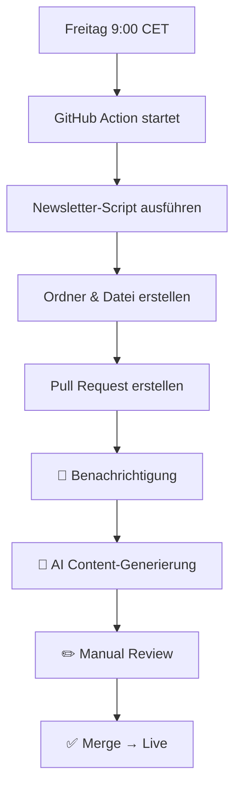

# 📅 Newsletter Automation System

Automatisierte wöchentliche Newsletter-Generierung für AI-Automation-Engineers.de

## 🎯 Überblick

Das System generiert jeden **Freitag um 9:00 CET** automatisch die Struktur für den wöchentlichen Newsletter und erstellt einen Pull Request zur Content-Erstellung.

## 📁 Dateien & Struktur

```
├── 📂 .github/workflows/
│   └── weekly-newsletter.yml     # GitHub Action für automatische Generierung
├── 📂 prompts/  
│   └── weekly-newsletter-prompt.md  # AI-Prompt für Content-Generierung
├── 📂 templates/
│   └── weekly-newsletter-template.md # Newsletter-Template mit Platzhaltern
├── 📂 scripts/
│   └── generate-newsletter.js    # Node.js Script für Newsletter-Erstellung
└── 📂 src/pages/newsletter/
    └── YYYY-MM-DD-weekly-ai-news-was-verpasst/  # Generierte Newsletter
```

## 🤖 Automatischer Workflow

### 1. **Zeitgesteuerte Ausführung**
- **Wann**: Jeden Freitag um 9:00 CET (8:00 UTC)
- **Was**: GitHub Action startet automatisch

### 2. **Newsletter-Generierung**
- Erstellt Ordnerstruktur: `YYYY-MM-DD-weekly-ai-news-was-verpasst/`
- Generiert `index.md` basierend auf Template
- Füllt Metadaten (Wochennummer, Datum, etc.)
- Fügt Placeholder-Content hinzu

### 3. **Pull Request Erstellung**
- Branch: `newsletter/week-XX-YYYY`
- Titel: "📅 Weekly Newsletter KWXX/YYYY - Ready for AI Content"  
- Labels: `newsletter`, `automated`, `content-needed`
- Assignee: Repository Owner

## ✏️ Content-Erstellung mit AI

### 📋 Schritt-für-Schritt

1. **Pull Request öffnen** - GitHub benachrichtigt dich automatisch

2. **AI-Prompt verwenden** 
   ```bash
   cat prompts/weekly-newsletter-prompt.md
   ```

3. **Newsletter-Datei öffnen**
   ```
   src/pages/newsletter/YYYY-MM-DD-weekly-ai-news-was-verpasst/index.md
   ```

4. **Placeholder ersetzen**
   - `[AI-TOOL]` → Echte Tool-Namen
   - `[UNTERNEHMEN]` → Microsoft, Google, OpenAI, etc.
   - `[SCHLAGZEILE]` → Aussagekräftige Headlines
   - `[BESCHREIBUNG]` → Konkrete Entwicklungen
   - `[Weiterlesen →](/blog/...)` → Links zu bestehenden Artikeln

5. **Review & Merge** - Newsletter geht live

## 🎨 Template-System

### Verfügbare Platzhalter
```markdown
{{WEEK_NUMBER}}          # Kalenderwoche (1-53)
{{YEAR}}                 # Aktuelles Jahr  
{{CURRENT_DATE}}         # YYYY-MM-DD Format
{{NEWSLETTER_EDITION}}   # "ersten/zweiten/..."
{{ESTIMATED_READ_TIME}}  # Geschätzte Lesezeit
{{HERO_IMAGE_URL}}       # Header-Bild URL

# Content-Sektionen
{{INTRO_TEXT}}           # Einleitung
{{TOP_STORIES_LIST}}     # Bullet-Point Liste der Top-Stories
{{TOP_STORY_1/2/3}}      # Detaillierte Hauptartikel
{{TOOLS_SECTION}}        # Neue Tools & Frameworks
{{INVESTMENT_SECTION}}   # Funding & Partnerships
{{CREATIVE_TOOLS_SECTION}} # AI-Tools für Content
{{QUICKIES_LIST}}        # Kurze News-Snippets
{{ANALYSIS_SECTION}}     # Wochenanalyse
{{TREND_LIST}}           # Top-4 Trends der Woche
```

## 🔧 Manuelle Ausführung

### Via GitHub Interface
1. Gehe zu "Actions" → "Weekly Newsletter Generation"
2. Klicke "Run workflow"
3. Trigger manuell

### Via Command Line
```bash
# Newsletter-Script ausführen
node scripts/generate-newsletter.js

# Newsletter-Ordner wird erstellt:
ls src/pages/newsletter/
```

## 🎯 Content-Richtlinien

### Zielgruppe
- **B2B-Fokus**: Unternehmen, IT-Teams, CTOs
- **Expertise-Level**: Intermediate bis Advanced
- **Branchen**: AI-Automation, DevOps, Enterprise IT

### Themen-Schwerpunkte
1. **AI-Automation Tools**: N8N, Zapier, Make, Langflow
2. **Enterprise AI**: Microsoft Copilot, Google Workspace
3. **Developer AI**: GitHub Copilot, Cursor, Claude
4. **Agents & Workflows**: Multi-agent systems, MCP
5. **Business Impact**: ROI, Zeitersparnis, Workflows

### Tonalität
- **Professionell**: Seriös und fundiert
- **Praktisch**: Konkreter Business-Nutzen
- **Enthusiastisch**: Positive Grundhaltung zu AI
- **Deutsch**: Native deutsche Sprache

## 📊 Beispiel-Workflow



## 🚀 Erweiterungen

### Mögliche Verbesserungen
- **AI-Integration**: Automatische Content-Generierung via OpenAI API
- **RSS-Feeds**: Automatisches Sammeln von AI-News
- **Analytics**: Newsletter-Performance Tracking
- **Social Media**: Auto-Sharing auf LinkedIn/Twitter

### Custom Configuration
```javascript
// scripts/generate-newsletter.js anpassen
const config = {
  readTime: 8,        // Geschätzte Lesezeit
  heroImage: "...",   // Standard-Bild
  sections: [...],    // Custom Sektionen
};
```

## 🆘 Troubleshooting

### Häufige Probleme

**Newsletter wird nicht generiert:**
- Prüfen ob Ordner bereits existiert
- GitHub Action Logs in "Actions" tab prüfen

**Pull Request fehlt:**
- Permissions prüfen: `contents: write`, `pull-requests: write`
- Branch protection rules prüfen

**Template-Fehler:**
- `templates/weekly-newsletter-template.md` validieren
- Platzhalter-Syntax: `{{PLACEHOLDER}}`

## 📞 Support

Bei Problemen:
1. GitHub Action Logs prüfen
2. Issue im Repository erstellen  
3. Newsletter manuell erstellen: `node scripts/generate-newsletter.js`

---

**Happy Automating! 🤖✨**
