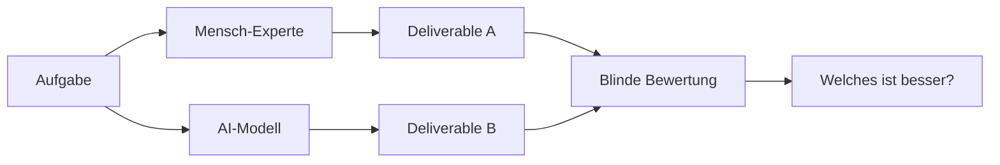

**TL;DR:** OpenAI hat mit GDPval einen neuen Benchmark veröffentlicht, der AI-Modelle an 1.320 echten Arbeitsaufgaben aus 44 Berufen testet. Das Ergebnis: Moderne AI-Modelle erreichen bereits bei vielen wirtschaftlich wertvollen Aufgaben menschliches Expertenniveau.

Vergiss MMLU-Scores und synthetische Benchmarks. Die wirklich relevante Frage ist: **Kann AI tatsächlich die Arbeit machen, für die Menschen bezahlt werden?**

OpenAI hat genau diese Frage gestellt - und die Antworten könnten die Arbeitswelt, wie wir sie kennen, fundamental verändern.

## Was ist GDPval? (Spoiler: Ein Reality-Check für AI)

GDPval steht für "Gross Domestic Product valuation" - und der Name ist Programm. Statt AI an akademischen Rätseln zu messen, testet GDPval, ob AI-Modelle **echte wirtschaftlich wertvolle Arbeit** erledigen können.

### Die Zahlen sprechen für sich:
- 🎯 **44 Berufe** aus 9 Wirtschaftssektoren
- 📊 **1.320 reale Arbeitsaufgaben**
- 👔 **14 Jahre** durchschnittliche Berufserfahrung der Task-Designer
- 💰 **5%+ GDP-Anteil** pro ausgewähltem Sektor

Das ist kein Spielzeug-Benchmark. Das ist die echte Arbeitswelt in Zahlen.

## Die Revolution: Von Theorie zu Praxis

### Bisherige Benchmarks vs. GDPval

| Aspekt | Traditionelle Benchmarks | GDPval |
|--------|-------------------------|--------|
| **Aufgaben** | Synthetische Tests | Echte Arbeitsaufgaben |
| **Designer** | AI-Forscher | Branchenprofis mit 14+ Jahren Erfahrung |
| **Output** | Textantworten | Präsentationen, Excel-Sheets, CAD-Zeichnungen |
| **Bewertung** | Automatisiert | Menschliche Experten (blind) |
| **Relevanz** | Akademisch | Wirtschaftlich messbar |

## Die getesteten Berufsfelder (Eine bunte Mischung)

GDPval deckt ein beeindruckendes Spektrum ab:

```python
berufe_sample = {
    "Tech": ["Software Engineer", "Data Analyst", "UX Designer"],
    "Legal": ["Lawyer", "Paralegal", "Compliance Officer"],
    "Healthcare": ["Pharmacist", "Nurse", "Medical Coder"],
    "Creative": ["Video Editor", "Content Writer", "Graphic Designer"],
    "Business": ["Product Manager", "Financial Analyst", "HR Manager"],
    "Engineering": ["CAD Designer", "Civil Engineer", "Quality Inspector"],
    # ... und 26 weitere Berufe
}
```

## Wie funktioniert die Bewertung?

### Phase 1: Task-Creation durch Profis

Echte Experten mit durchschnittlich **14 Jahren Berufserfahrung** erstellen Aufgaben aus ihrem Arbeitsalltag:

- **Software Engineer**: "Refaktoriere diesen Legacy-Code und schreibe Unit-Tests"
- **Lawyer**: "Verfasse einen Vertragsentwurf basierend auf diesen Anforderungen"
- **Video Editor**: "Schneide dieses Rohmaterial zu einem 30-Sekunden-Spot"
- **Pharmacist**: "Prüfe diese Medikamentenliste auf Wechselwirkungen"

### Phase 2: AI vs. Human Deliverables



### Phase 3: Blinde Experten-Bewertung

Branchenprofis bewerten die Ergebnisse, **ohne zu wissen**, welches von AI und welches von Menschen stammt:

- **"Besser als Mensch"**: AI gewinnt
- **"Gleichwertig"**: Unentschieden
- **"Schlechter als Mensch"**: Mensch gewinnt

## Die Ergebnisse: Beeindruckend und beunruhigend

### 🎯 Die Headline-Zahlen

Bei modernen Frontier-Modellen (GPT-4o, Claude 3.5, etc.):
- **~50% der Aufgaben**: AI erreicht oder übertrifft menschliches Expertenniveau
- **Trend**: Mit jedem neuen Modell steigt die Quote
- **Geschwindigkeit**: AI ist 10-100x schneller als Menschen
- **Kosten**: Bruchteil menschlicher Arbeitskosten

### Die Stärken der AI

**Top-Performance Bereiche:**
```javascript
const ai_dominanz = {
  datenanalyse: "95% Win-Rate bei Excel-Analysen",
  code_generation: "85% bei Standard-Programmieraufgaben",
  text_creation: "80% bei strukturierten Berichten",
  recherche: "90% bei Informationszusammenfassungen"
};
```

### Die (noch) menschlichen Domänen

**Wo Menschen führen:**
- 🎨 **Kreative Originalität**: Neue Konzepte von Grund auf
- 🤝 **Emotionale Intelligenz**: Kundengespräche mit Empathie
- 🔧 **Physische Integration**: CAD zu realem Produkt
- 🧠 **Kontextuelle Nuancen**: Feine kulturelle Unterschiede

## Typische AI-Fehler (Die Achillesferse)

Die Analyse zeigt wiederkehrende Muster:

### 1. Instruction-Following Errors
```python
# Aufgabe: "Erstelle eine 5-Folien-Präsentation"
# AI-Output: 7 Folien mit zusätzlichem Material
# Problem: Gut gemeint, aber Anforderung verfehlt
```

### 2. Formatting Mistakes
```excel
# Aufgabe: "Formatiere als Pivot-Tabelle"
# AI-Output: Normale Tabelle mit ähnlicher Struktur
# Problem: Fast richtig ist auch falsch
```

### 3. Halluzinationen
```text
Aufgabe: "Analysiere diese Verkaufsdaten"
AI: "Basierend auf Q3-Daten..." 
Reality: Nur Q1 und Q2 Daten vorhanden
```

### 4. Über-Elaboration
```markdown
Aufgabe: "Kurze Email an Chef"
AI: [500 Wörter Essay mit Einleitung, Hauptteil, Schluss]
Mensch: [3 Sätze, auf den Punkt]
```

## Die wirtschaftlichen Implikationen

### ROI-Rechnung für Unternehmen

```python
def calculate_ai_roi(task):
    human_time = 2  # Stunden
    human_cost = 50 * human_time  # $50/Stunde
    ai_time = 0.02  # 1.2 Minuten
    ai_cost = 0.10  # API-Kosten
    time_saved = human_time - ai_time
    cost_saved = human_cost - ai_cost
    return {
        "time_efficiency": f"{(time_saved/human_time)*100:.0f}%",
        "cost_reduction": f"{(cost_saved/human_cost)*100:.0f}%",
        "roi_factor": f"{human_cost/ai_cost:.0f}x"
    }
# Ergebnis: 99% Zeitersparnis, 99.9% Kostenreduktion, 1000x ROI
```

### Berufe im Wandel

**High Impact (>70% Automatisierungspotenzial):**
- Data Entry Specialists
- Junior Programmierer
- Content Writers (Standard-Content)
- Erste-Level Support

**Medium Impact (30-70%):**
- Senior Entwickler
- Marketing Manager
- Financial Analysts
- Projekt Manager

**Low Impact (<30%):**
- C-Level Executives
- Kreativdirektoren
- Therapeuten
- Handwerker

## Technische Deep-Dive: Die Methodik

### Multi-Modal Evaluation

GDPval testet nicht nur Text, sondern:
```javascript
const modalitäten = {
  text: ["Docs", "Emails", "Berichte"],
  tabellen: ["Excel", "CSV", "Datenbanken"],
  präsentationen: ["PowerPoint", "Keynote"],
  code: ["Python", "JavaScript", "SQL"],
  audio: ["Podcasts", "Transkriptionen"],
  video: ["Schnitt", "Untertitel"],
  cad: ["3D-Modelle", "Technische Zeichnungen"]
};
```

### Die Bewertungs-Rubriken

Jede Aufgabe hat spezifische Kriterien:
```yaml
task_evaluation:
  instruction_following: 30%
  technical_accuracy: 25%
  formatting: 20%
  creativity: 15%
  efficiency: 10%
```

## Best Practices: AI richtig einsetzen

### 1. Der Sweet Spot finden
```python
def optimal_ai_usage(task):
    if task.routine_level > 0.7:
        return "Full AI Automation"
    elif task.creative_need < 0.3:
        return "AI Draft + Human Polish"
    else:
        return "Human Lead + AI Assist"
```

### 2. Scaffolding für bessere Ergebnisse
```javascript
// Statt:
await ai.complete("Schreibe einen Report");
// Besser:
const result = await ai.complete({
  task: "Schreibe einen Report",
  format_check: true,
  self_review: true,
  output_validation: reportSchema,
  reasoning_steps: "explicit"
});
```

### 3. Human-in-the-Loop behalten
- **Quality Gates**: Menschen prüfen kritische Outputs
- **Feedback Loops**: Kontinuierliche Verbesserung
- **Escalation Paths**: Komplexe Fälle an Menschen

## Was bedeutet das für deine Karriere?

### Die unbequeme Wahrheit

Wenn AI bereits heute 50% der Aufgaben auf Expertenniveau erledigen kann, wo stehen wir in 5 Jahren?

### Die Survival-Strategie

**Level Up in diesen Bereichen:**
1. **AI-Orchestrierung**: Werde zum Dirigenten, nicht zum Instrument
2. **Kreative Problemlösung**: Fokus auf Novel Solutions
3. **Menschliche Verbindung**: Empathie ist nicht programmierbar
4. **System-Thinking**: Verstehe das große Ganze
5. **Continuous Learning**: Bleibe ahead of the curve

### Die Opportunity

```python
# Die Zukunfts-Formel
you_2030 = current_skills + ai_amplification - automated_tasks + new_capabilities
# Wenn du es richtig machst:
productivity_gain = 10x
value_creation = 100x
career_options = "unlimited"
```

## Fazit: Der Wendepunkt ist jetzt

GDPval ist mehr als nur ein Benchmark - es ist ein Weckruf. Die Frage ist nicht mehr **ob** AI unsere Arbeit übernehmen kann, sondern **wann** und **wie schnell**.

**Die wichtigsten Takeaways:**
1. **AI ist bereit für echte Arbeit** - nicht in der Zukunft, sondern heute
2. **50% Parität ist erst der Anfang** - die Kurve zeigt steil nach oben
3. **Anpassung ist keine Option** - es ist eine Notwendigkeit
4. **Die größte Chance ever** - für die, die sie ergreifen
5. **Menschlichkeit bleibt wertvoll** - aber anders als gedacht

### Action Items für AI-Automation Engineers

1. **Teste deine eigene Arbeit**: Welche deiner Tasks könnte GDPval messen?
2. **Identifiziere deine Unique Value**: Was machst du, was AI (noch) nicht kann?
3. **Experimentiere mit Frontier Models**: Nutze GPT-4o, Claude 3.5 für echte Arbeit
4. **Baue AI-augmented Workflows**: Multipliziere deine Produktivität
5. **Teile dein Wissen**: Die Community braucht Pioniere

Die GDPval-Ära hat begonnen. Die Arbeitswelt wird nie wieder dieselbe sein. Die Frage ist nur: Bist du Gestalter oder Zuschauer dieser Revolution?

Welcome to the future of work - it's already here! 🚀

---

*Quelle: OpenAI GDPval Paper, September 2025*
*Benchmark verfügbar unter: evals.openai.com*