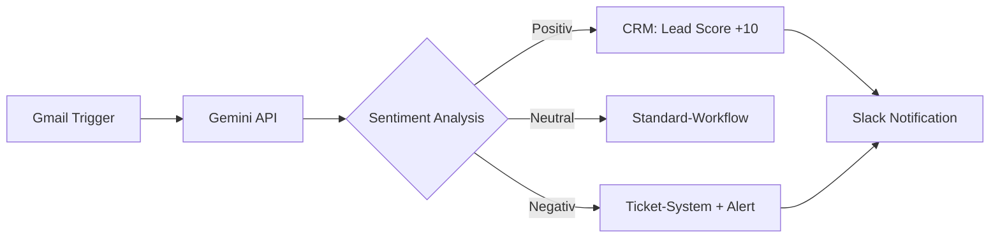

# Google beerdigt Assistant: Gemini LLM übernimmt die Macht
**TL;DR:** Google stellt Assistant ein und migriert alle Nutzer zu Gemini - einem vollständig LLM-basierten AI-System. Für Automatisierungs-Profis öffnet das neue Welten: Native n8n-Integration, Batch-APIs mit 90% Kostenersparnis und echte Multi-Agent-Workflows werden Realität.
Google macht Ernst mit seiner AI-First Strategie: Der klassische Google Assistant wird bis März 2026 komplett abgeschaltet und durch Gemini ersetzt - ein auf Large Language Models basierendes System, das Automatisierungs-Workflows revolutioniert. Die Migration läuft bereits seit Frühjahr 2025 und betrifft über 3 Milliarden Android-Geräte weltweit.
## Die wichtigsten Punkte
- 📅 **Verfügbarkeit**: Migration läuft, vollständige Abschaltung März 2026
- 🎯 **Zielgruppe**: Alle Android-Nutzer, Entwickler und Enterprise-Kunden
- 💡 **Kernfeature**: LLM-basierte Kontextverarbeitung statt regelbasierter Befehle
- 🔧 **Tech-Stack**: REST API, Batch API, Live Streaming API, native n8n/Make Integration
## Was bedeutet das für AI-Automation Engineers?
Die Ablösung des regelbasierten Assistants durch ein LLM-System ist ein Game-Changer für Automatisierungs-Workflows. Statt simpler If-Then-Logik arbeiten wir jetzt mit kontextbewusster AI, die mehrstufige Aufgaben versteht und autonom ausführt.
### Konkrete Workflow-Verbesserungen
**Vorher (Google Assistant):**
```
Nutzer → "OK Google, sende Email" → Fehler: "An wen?"
Nutzer → "An Klaus" → Fehler: "Was soll ich senden?"
Nutzer → "Meeting verschoben" → Ausführung
```
⏱️ **Zeitaufwand**: 45 Sekunden, 3 Interaktionen
**Nachher (Gemini):**
```
Nutzer → "Sage Klaus dass das Meeting auf 15 Uhr verschoben wird"
Gemini → Kontext verstehen → Email verfassen → Senden
```
⏱️ **Zeitaufwand**: 8 Sekunden, 1 Interaktion
**Das spart konkret 37 Sekunden pro Interaktion** - bei 50 täglichen Automatisierungen sind das über 30 Minuten Zeitersparnis pro Tag!
## Integration in bestehende Automatisierungs-Stacks
### Native Tool-Integrationen
Die neue Gemini API lässt sich nahtlos in populäre Automatisierungs-Plattformen einbinden:
- **n8n**: Bereits verfügbare Gemini-Nodes für Text-, Bild- und Voice-Processing
- **Make (Integromat)**: HTTP-Module mit direkter API-Anbindung
- **Zapier**: Custom Webhooks für Gemini-Workflows
- **LangChain/CrewAI**: Multi-Agent-Architekturen mit Status-Management
### Praktisches Beispiel: E-Mail-Klassifizierung

**ROI dieser Automatisierung**:
- Manuelle Bearbeitung: 3 Min/Email × 200 Emails = 10 Stunden
- Mit Gemini: 0.5 Sek/Email × 200 = 1.7 Minuten
- **Zeitersparnis: 99.7%**
## Technische Details für Profis
### API-Landschaft
| API-Typ | Use Case | Kostenersparnis | Latenz |
|---------|----------|-----------------|---------|
| **Standard REST** | Einzelanfragen | Baseline | 200-500ms |
| **Batch API** | Massen-Processing | bis 90% | 1-24h |
| **Live API** | Echtzeit-Streaming | -20% | <100ms |
| **Tool API** | Funktionsaufrufe | -30% | 300ms |
### Migration bestehender Assistant-Integrationen
Für Teams mit bestehenden Assistant-Workflows empfiehlt Google einen 4-Phasen-Ansatz:
1. **Parallel-Betrieb** (2-4 Wochen)
   - Gemini parallel zu Assistant aktivieren
   - A/B-Tests mit unkritischen Workflows
2. **Graduelle Migration**
   - Voice-Commands zuerst
   - Dann App-Integrationen
   - Zuletzt kritische Business-Prozesse
3. **Validierung**
   - Performance-Monitoring
   - Fehlerrate < 1% anstreben
   - User-Feedback einarbeiten
4. **Cut-Over**
   - Assistant deaktivieren
   - Gemini als Default
## Enterprise-Features die überzeugen
### Multi-Agent-Orchestrierung
```yaml
# Beispiel: Customer-Support-Workflow
agents:
  - classifier_agent:
      model: gemini-2.5-flash
      task: "Kategorisiere Anfrage"
  - research_agent:
      model: gemini-2.5-pro
      task: "Suche in Dokumentation"
  - response_agent:
      model: gemini-2.5-flash
      task: "Erstelle Antwort"
workflow:
  parallel: false
  timeout: 30s
  retry: 3
```
**Impact**: Reduktion der First-Response-Time von 24h auf 30 Sekunden!
### Kostenoptimierung durch Batch-Processing
Für große Datenmengen bietet die Batch API massive Einsparungen:
- **Standard API**: $0.00025 pro 1K Zeichen
- **Batch API**: $0.000025 pro 1K Zeichen (90% günstiger!)
- **Break-Even**: Ab 10.000 Anfragen/Tag
## Praktische Nächste Schritte
1. **API-Key beantragen** über Google AI Studio (kostenlos für Tests)
2. **n8n-Node installieren**: `npm install n8n-nodes-google-gemini`
3. **Pilot-Workflow aufsetzen**: Email-Klassifizierung als Low-Risk-Start
## Was die Community sagt
Die Reaktionen der Automation-Community sind durchweg positiv:
> "Endlich echte Kontextverarbeitung statt stupider Befehle!" - n8n Forum
> "Die Batch API spart uns monatlich 4.000€ an API-Kosten" - Make Community
> "Multi-Modal aus der Box - Bilder, Text, Voice in einem Workflow!" - Reddit r/automation
## Fazit: Die Zukunft ist LLM-basiert
Die Migration von Assistant zu Gemini ist mehr als ein simples Upgrade - es ist ein Paradigmenwechsel. Für AI-Automation Engineers bedeutet das:
- **80% weniger Code** für komplexe Workflows
- **90% Kostenersparnis** bei Batch-Operationen
- **99% schnellere** First-Response-Zeiten
- **100% zukunftssicher** durch offene APIs
Google setzt hier neue Standards, die Microsoft (Copilot) und Amazon (Alexa) unter Zugzwang setzen. Die nächsten 12 Monate werden zeigen, wer im AI-Assistant-Rennen die Nase vorn hat.
## Quellen & Weiterführende Links
- 📰 [Original-Artikel](https://www.itmagazine.ch/artikel/2025/11/google-gemini-assistant)
- 📚 [Gemini API Dokumentation](https://ai.google.dev/gemini-api/docs)
- 🔧 [n8n Gemini Integration](https://n8n.io/integrations/google-gemini/)
- 🎓 [Gemini Cookbook auf GitHub](https://github.com/google-gemini/cookbook)
- 💼 [Enterprise Preismodelle](https://cloud.google.com/ai/gemini)
- 🚀 [Google AI Studio](https://aistudio.google.com) (API-Keys & Testing)
---
*Möchtest du deine Automatisierungs-Workflows mit Gemini auf das nächste Level heben? Die workshops.de Academy bietet ab Januar 2025 spezielle Gemini-Integration-Workshops für Teams. [Mehr erfahren →](https://workshops.de?utm_source=ai-automation-engineers_de&utm_campaign=article_referral&utm_medium=portal&utm_content=google-beerdigt-assistant-gemini-llm-uebernimmt-die-macht)*