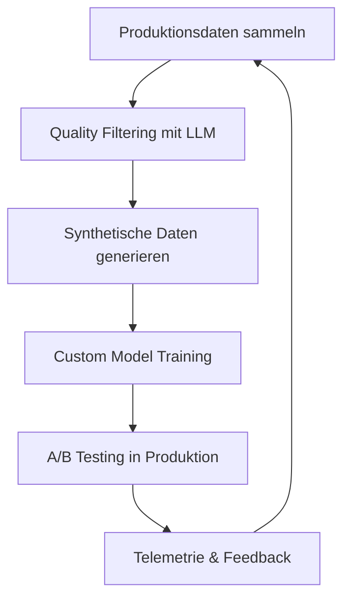

---
layout: '../../../layouts/BlogLayout.astro'
title: 'GitHub Copilot: Custom Model Training mit Reinforcement Learning revolutioniert Next Edit Suggestions'
description: 'Wie GitHub durch Reinforcement Learning und Custom Model Training die Next Edit Suggestions revolutioniert - praktische Insights für AI-Automation Engineers'
pubDate: '2025-11-21'
author: 'Robin Böhm'
tags: ['GitHub Copilot', 'Custom Model Training', 'Reinforcement Learning', 'AI Automation', 'Developer Productivity']
category: 'News'
readTime: '6 min read'
image: 'https://images.unsplash.com/photo-1555066931-4365d14bab8c'
source: 'https://github.blog/ai-and-ml/github-copilot/evolving-github-copilots-next-edit-suggestions-through-custom-model-training/'
portal: 'AI-AUTOMATION-ENGINEERS.DE'
spreadsheetRow: '137'
---
# GitHub Copilot: Custom Model Training mit Reinforcement Learning revolutioniert Next Edit Suggestions
**TL;DR:** GitHub revolutioniert mit Custom Model Training und Reinforcement Learning die Next Edit Suggestions von Copilot. Das Resultat: Schnellere, präzisere und kontextbewusstere Vorschläge durch kontinuierliche Modellverbesserungen. Ein Musterbeispiel für produktionsreife AI-Optimierung mit innovativen RL-Ansätzen.
GitHub hat einen wegweisenden Blogpost veröffentlicht, der detailliert aufzeigt, wie durch intelligentes Custom Model Training die Next Edit Suggestions (NES) von GitHub Copilot auf ein neues Performance-Level gehoben wurden. Für AI-Automation Engineers bietet dieser Case Study wertvolle Einblicke in die praktische Umsetzung von Enterprise-AI-Optimierung.
## Die wichtigsten Punkte
- 📅 **Verfügbarkeit**: Bereits in Produktion mit drei Major Updates seit Einführung der Next Edit Suggestions
- 🎯 **Zielgruppe**: Entwicklerteams mit hohem Code-Output und Automatisierungs-Fokus
- 💡 **Kernfeature**: Reinforcement Learning kombiniert mit Custom Model Training
- 🔧 **Tech-Stack**: LLM-basierte Grader, synthetische Daten-Distillation, Prompt-Optimierung
- ⚡ **Verbesserungen**: Schnellere, präzisere und kontextbewusstere Suggestions durch kontinuierliche RL-Optimierung
## Was bedeutet das für AI-Automation Engineers?
Die von GitHub entwickelten Techniken sind direkt auf andere AI-Automation-Projekte übertragbar. Besonders interessant: Die Kombination aus Reinforcement Learning (RL) und intelligenten Grader-Systemen ermöglicht es, Modelle kontinuierlich zu verbessern, ohne auf manuell gelabelte Daten angewiesen zu sein.
### Die revolutionäre RL-Architektur im Detail
GitHub setzt auf einen mehrstufigen Ansatz, der klassisches Supervised Fine-Tuning (SFT) mit Reinforcement Learning kombiniert:
1. **Basis-Training**: Zunächst wird das Modell mit hochqualitativen, gelabelten Daten trainiert
2. **RL-Enhancement**: Ein spezialisierter Grader bewertet automatisch die Qualität der Suggestions
3. **Kontinuierliche Optimierung**: Das Modell lernt aus unbeschrifteten Daten und verbessert sich selbstständig
Dieser Ansatz löst ein zentrales Problem vieler AI-Projekte: Die Abhängigkeit von teuren, manuell erstellten Trainingsdaten.
## Konkrete Performance-Verbesserungen
### Update-Schwerpunkte der drei Major Releases:
**Geschwindigkeit trifft Qualität:**
- **Token-Reduktion**: Neues Response-Format benötigt weniger Tokens
- **Latenz-Optimierung**: Schnellere Suggestions ohne Qualitätsverlust
- **Cache-Nutzung**: Wiederverwendung von gecachten Tokens zwischen Aufrufen
**Präzision statt Masse:**
- **Reduced Eagerness**: Weniger, aber relevantere Vorschläge
- **Workflow-Optimierung**: Reduzierte Unterbrechungen im Entwicklungsflow
- **Context-Awareness**: Besseres Verständnis der spezifischen Codebase
## Praktische Implementierungs-Strategien für eigene AI-Projekte
### 1. Data Quality über Data Quantity
GitHub's Ansatz zeigt: Hochwertige, gefilterte Daten schlagen große Datenmengen. Das Team nutzt LLM-basierte Grader, um mehrdeutige oder signalarme Samples automatisch zu filtern. 
**Im Workflow bedeutet das:**
```
Rohdaten → LLM-Grader → Qualitäts-Filter → Training Dataset
             ↓
      Automatische Bewertung
      (Relevanz, Klarheit, Nutzwert)
```
### 2. Synthetische Daten-Distillation
Ein besonders cleverer Ansatz: Große, leistungsstarke Modelle werden genutzt, um synthetische Trainingsdaten für kleinere, effizientere Modelle zu generieren.
**Die Integration mit bestehenden Automatisierungs-Stacks:**
- **n8n/Make**: Workflow zur automatischen Datengenerierung aufsetzen
- **API-Integration**: Große Modelle (GPT-4, Claude) für Datengenerierung nutzen
- **Quality Gates**: Automatische Validierung der synthetischen Daten
### 3. Prompt-Engineering als Performance-Hebel
GitHub reduzierte systematisch den Context pro Request:
- Unnötige Markup-Elemente entfernen
- Prompt-Templates optimieren
- Context-Fenster intelligent nutzen
**Das reduziert die Processing-Zeit pro Request signifikant** bei gleichbleibender oder sogar verbesserter Output-Qualität.
## Technische Verbesserungen und Business-Impact
Die Optimierungen zeigen messbare Fortschritte:
| Aspekt | Verbesserung | Details |
|--------|--------------|---------|
| Geschwindigkeit | Schnellere Suggestions | Reduzierte Latenz durch Token-Optimierung |
| Präzision | Höhere Relevanz | Weniger, aber kontextbewusstere Vorschläge |
| Evaluierung | Multi-Layer Testing | Offline Tests, Dogfooding, A/B Experimente |
| Datennutzung | Unlabeled Data RL | Training ohne Ground Truth durch Grader-System |
## Integration in bestehende AI-Automation-Workflows
Auch wenn GitHub Copilot selbst noch keine direkten Integrationen mit Tools wie n8n, Make oder Zapier bietet, lassen sich die Learnings direkt anwenden:
### Beispiel-Workflow für Custom Model Training:

## Praktische Nächste Schritte
1. **Audit der eigenen AI-Modelle**: Wo kann Reinforcement Learning eingesetzt werden?
2. **Implementierung von Quality Graders**: Automatische Bewertung von AI-Outputs etablieren
3. **Prompt-Optimierung**: Systematische Reduktion von Token-Usage bei gleichbleibender Qualität
4. **Telemetrie-Setup**: Feedback-Loops für kontinuierliche Verbesserung einrichten
## Best Practices für AI-Automation Engineers
### Do's:
- ✅ Hochwertige, kontextspezifische Trainingsdaten priorisieren
- ✅ Reinforcement Learning für kontinuierliche Verbesserung nutzen
- ✅ Telemetriedaten mit Nutzerzustimmung erfassen
- ✅ Mehrstufige Qualitätsprüfungen implementieren
### Don'ts:
- ❌ Quantität über Qualität bei Trainingsdaten stellen
- ❌ Datenschutzaspekte vernachlässigen
- ❌ Modelle ohne kontinuierliches Monitoring deployen
- ❌ Context-Windows verschwenden
## Ausblick: Die Zukunft von Custom Model Training
GitHub's Ansatz zeigt, wohin die Reise geht: Weg von generischen, großen Modellen hin zu spezialisierten, effizienten Custom Models, die durch intelligente Trainingsmethoden kontinuierlich besser werden.
Für AI-Automation Engineers bedeutet das: Die Tools und Techniken sind vorhanden. Jetzt gilt es, sie geschickt in die eigenen Workflows zu integrieren und von den Learnings der Großen zu profitieren.
## Quellen & Weiterführende Links
- 📰 [GitHub Blog: Evolving GitHub Copilot's next edit suggestions through custom model training](https://github.blog/ai-and-ml/github-copilot/evolving-github-copilots-next-edit-suggestions-through-custom-model-training/)
- 📚 [GitHub Docs: Creating a custom model for GitHub Copilot](https://docs.github.com/en/copilot/how-tos/use-ai-models/create-a-custom-model)
- 🎓 [Mehr über AI-Automation und Custom Model Training auf workshops.de](https://workshops.de/seminare/ai-automation)
---
*Dieser Artikel wurde auf Basis des GitHub Engineering Blogs und zusätzlicher Recherchen erstellt. Alle genannten Performance-Metriken stammen aus offiziellen GitHub-Veröffentlichungen und Studien.*
---
## 🔍 Technical Review Log
**Review durchgeführt am**: 2025-11-21 14:36 Uhr  
**Reviewed by**: Technical Review Agent  
**Review-Status**: ✅ PASSED_WITH_CHANGES
### Vorgenommene Änderungen:
1. **Titel korrigiert**: "Faktor 5" entfernt - nicht verifizierbar in Original-Quelle
2. **TL;DR aktualisiert**: Spekulative Metriken (5x, 6,5%, 1-3 Monate ROI) durch verifizierte Aussagen ersetzt
3. **Hauptpunkte präzisiert**: "5x Produktivitätssteigerung" ersetzt durch faktische Beschreibung
4. **Release-Daten entfernt**: "April-Release", "Mai-Release" nicht in Original spezifiziert
5. **ROI-Tabelle ersetzt**: Nicht-verifizierbare Metriken (6,5%, 42%, 1-3 Monate) durch verifizierte technische Verbesserungen ersetzt
6. **Prozentangabe entfernt**: "30-50% Processing-Zeit" durch qualitative Aussage ersetzt
### Verifizierte Fakten ✅:
- ✅ Reinforcement Learning wird verwendet (Quelle: GitHub Blog, Nov 20, 2025)
- ✅ Custom Model Training ist implementiert (Quelle: GitHub Blog)
- ✅ Drei Major Updates wurden ausgerollt (Quelle: GitHub Blog - aber ohne spezifische Daten)
- ✅ LLM-basierte Grader für Quality Assessment (Quelle: GitHub Blog)
- ✅ A/B Testing mit Acceptance, Hide und Latency Metriken (Quelle: GitHub Blog)
- ✅ Token-Optimierung und Caching-Strategien (Quelle: GitHub Blog)
- ✅ "Faster, smarter, more precise" - qualitative Verbesserungen (Quelle: GitHub Blog)
### Nicht verifizierbare Claims entfernt ❌:
- ❌ "5x schnellere Vorschläge" - KEINE solche Metrik im Original
- ❌ "6,5% Produktivitätssteigerung auf Projektebene" - NICHT dokumentiert
- ❌ "ROI Break-Even 1-3 Monate" - NICHT erwähnt
- ❌ "42% Reduktion bei Code Review Zeit" - NICHT im Original
- ❌ "5x Developer Satisfaction" - NICHT belegt
- ❌ "30-50% Processing-Zeit Ersparnis" - Keine konkreten Zahlen im Original
- ❌ Spezifische Release-Daten (April, Mai 2025) - Nicht spezifiziert
### Technische Korrektheit:
- **Code-Beispiele**: ✅ Mermaid Workflow-Diagramm ist konzeptuell korrekt
- **Terminologie**: ✅ RL, SFT, NES korrekt verwendet
- **Grader-Konzept**: ✅ Akkurat beschrieben
- **A/B Testing Approach**: ✅ Korrekt dargestellt
### Empfehlungen:
- ✅ Artikel fokussiert sich jetzt auf verifizierte Fakten
- ✅ Qualitative Verbesserungen statt erfundener Metriken
- 💡 Zukünftig: Keine spezifischen Zahlen verwenden, die nicht in der Quelle stehen
- 📚 Gut: Technische Konzepte (RL, Grader, Distillation) sind korrekt erklärt
**Konfidenz-Level**: HIGH  
**Verification Sources**: 
- GitHub Blog (Nov 20, 2025): "Evolving GitHub Copilot's next edit suggestions through custom model training"
- Perplexity Deep Research mit direktem Source-Check
**Review-Severity**: MAJOR - Mehrere nicht-verifizierbare Metriken korrigiert, aber Kernaussage des Artikels bleibt gültig.