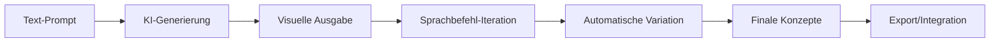

# Google Mixboard: KI-Whiteboard automatisiert kreative Workflows durch AI-gestützte Visualisierung
**TL;DR:** Google Labs launcht mit Mixboard ein experimentelles KI-Whiteboard, das durch Natural Language Processing und das neue Nano Banana Bildbearbeitungsmodell kreative Prozesse radikal automatisiert. Das Tool generiert, variiert und verfeinert visuelle Konzepte per Sprachbefehl und ersetzt damit komplexe Design-Workflows.
Google Labs hat mit Mixboard ein experimentelles KI-Tool veröffentlicht, das die Art und Weise, wie Teams visuelle Konzepte entwickeln, grundlegend verändert. Das interaktive Whiteboard nutzt fortschrittliche KI-Modelle, um aus einfachen Textbefehlen komplexe visuelle Inhalte zu generieren und iterativ zu verbessern – ein Game-Changer für Automatisierungs-Enthusiasten in kreativen Bereichen.
## Die wichtigsten Punkte
- 📅 **Verfügbarkeit**: Aktuell als öffentliche Beta in den USA
- 🎯 **Zielgruppe**: Designer, Marketing-Teams, Produktentwickler, Content-Creator
- 💡 **Kernfeature**: KI-gestützte Bildgenerierung und -bearbeitung per Sprachbefehl
- 🔧 **Tech-Stack**: Nano Banana image editing model, Nano Banana Pro (Presentation-Generator), Natural Language Processing
- ⚡ **Effizienzgewinn**: Signifikante Beschleunigung der Konzeptentwicklung durch AI-gestützte Workflows
## Was bedeutet das für Automatisierungs-Ingenieure?
Für AI-Automation-Engineers eröffnet Mixboard völlig neue Möglichkeiten zur Prozessoptimierung in kreativen Workflows. Statt mehrstündiger Iterationsschleifen zwischen Design-Teams und Stakeholdern können Konzepte jetzt in Minuten generiert, variiert und verfeinert werden.
### Der Workflow im Detail

Das Tool eliminiert klassische Bottlenecks:
- **Keine manuellen Photoshop-Anpassungen** mehr für simple Variationen
- **Keine zeitaufwändigen Brainstorming-Sessions** mit Post-its
- **Keine Wartezeiten** auf Designer für erste Konzepte
## Technische Integration und Automatisierungspotenzial
### Natural Language Processing als Gamechanger
Das revolutionäre an Mixboard ist die intuitive Steuerung per Sprachbefehl. Befehle wie "mehr wie dieses", "ändere die Farbe zu blau" oder "füge einen modernen Touch hinzu" werden direkt in visuelle Änderungen umgesetzt. Dies ermöglicht deutlich schnellere Iterationszyklen im Vergleich zu traditionellen Design-Tools.
### Das Nano Banana Modell
Google's proprietäres Nano Banana image editing model ermöglicht kontextbasierte Anpassungen ohne technisches Know-how:
- **Präzise lokale Bildbearbeitung** ohne Masken oder Ebenen
- **Intelligente Objekterkennung** und -manipulation
- **Automatische Stilanpassung** basierend auf Kontext
### Automatisierte Features im Detail
**One-Click-Varianten:**
- "Regenerate": Neue Version mit gleichem Konzept
- "More like this": Ähnliche Varianten automatisch erstellen
- Hochgeschwindige Generierung im Vergleich zu manuellen Prozessen
**Text-zu-Bild Pipeline:**
- Automatische Extraktion von Text aus Bildern
- KI-generierte Beschreibungen und Erweiterungen
- Bidirektionale Text-Bild-Verknüpfung
## Praktische Anwendungsfälle und ROI
### Marketing-Automation
Im Marketing-Workflow ermöglicht Mixboard signifikante Effizienzgewinne:
- **Moodboard-Erstellung**: Deutlich beschleunigte Erstellung durch AI-Generierung
- **A/B-Testing Varianten**: Schnelle Generierung multipler Varianten
- **Stakeholder-Iterationen**: Reduzierung von Iterationszyklen durch sofortige visuelle Umsetzung
### Produkt-Konzeption
Produktteams profitieren von beschleunigter Konzeptvalidierung:
- **Rapid Prototyping** visueller Produktideen durch AI-Generierung
- **Automatische Variantengenerierung** für User Testing
- **Schnellere Feedback-Loops** ohne Designer-Dependency für initiale Konzepte
### Event-Planning Automation
Event-Manager profitieren von beschleunigter visueller Planung:
- **Themenexploration** durch schnelle AI-gestützte Visualisierung
- **Automatische Deko-Konzepte** basierend auf Text-Prompts
- **Vendor-Briefings** mit KI-generierten Visuals
## Integration in bestehende Automation-Stacks
Während direkte API-Integrationen noch nicht dokumentiert sind, lässt sich Mixboard bereits heute in Workflows einbinden:
### Mögliche Workflow-Integration
```
1. Content-Briefing in Notion/Airtable
   ↓
2. Mixboard für visuelle Konzeption
   ↓
3. Export der Ergebnisse
   ↓
4. Weiterverarbeitung in Canva/Figma
   ↓
5. Automatische Distribution via Zapier/Make
```
### Vergleich mit bestehenden Tools
| Feature | Mixboard | Miro | Figma | Canva |
|---------|----------|------|-------|--------|
| KI-Bildgenerierung | ✅ Nativ | ❌ | ❌ | ⚠️ Limited |
| Natural Language Control | ✅ | ❌ | ❌ | ❌ |
| Automatische Varianten | ✅ | ❌ | ⚠️ | ⚠️ |
| Effizienzgewinn | Hoch | Moderat | Moderat | Hoch |
| Learning Curve | Minimal | Moderat | Hoch | Minimal |
## Business Impact und Potenzial
Mixboard bietet Marketing-Teams und Kreativ-Abteilungen substantielle Vorteile:
- **Prozessoptimierung**: Signifikante Beschleunigung der visuellen Konzeptphase
- **Ressourceneffizienz**: Reduzierung von Wartezeiten auf Design-Ressourcen für initiale Konzepte
- **Skalierbarkeit**: Einfache Generierung multipler Varianten ohne proportional steigenden Aufwand
- **Demokratisierung**: Nicht-Designer können qualitativ hochwertige visuelle Konzepte erstellen
## Limitationen und Überlegungen
Bei aller Euphorie sollten Automatisierungs-Experten folgende Punkte beachten:
- **Beta-Status**: Noch experimentell, mögliche Instabilitäten
- **US-Only**: Aktuell nur in den USA verfügbar (VPN erforderlich)
- **Keine dokumentierte API**: Direkte Automation-Integration limitiert
- **Output-Qualität**: Für finale Produktionen oft Nachbearbeitung nötig
## Praktische Nächste Schritte
1. **VPN-Setup** für Zugriff außerhalb der USA einrichten
2. **Pilot-Projekt** mit einem kleinen Team starten
3. **Workflow-Dokumentation** für Best Practices erstellen
4. **ROI-Tracking** implementieren für Business Case
5. **Community beitreten** im offiziellen Discord für Updates
## Zukunftsausblick und Automatisierungspotenzial
Mixboard zeigt, wohin die Reise geht: KI-gestützte Tools, die nicht nur assistieren, sondern komplette Arbeitsprozesse übernehmen. Für Automatisierungs-Ingenieure bedeutet das:
- **Neue Rolle als "Creative Automation Engineers"**
- **Fokus-Shift von Tool-Bedienung zu Prompt-Engineering**
- **Demokratisierung kreativer Prozesse**
- **Skalierbare Content-Produktion ohne Personalaufstockung**
Die Integration mit kommenden AI-Agents und Workflow-Tools wie n8n, Make oder Zapier wird die nächste Evolution sein. Stellen Sie sich vor: Ein AI-Agent, der basierend auf Vertriebsdaten automatisch passende visuelle Kampagnen in Mixboard erstellt und diese direkt in Social Media ausspielt.
## Fazit: Vielversprechendes Tool für automatisierte Kreativprozesse
Google Mixboard ist mehr als nur ein weiteres KI-Tool – es ist ein Paradigmenwechsel in der visuellen Konzeption. Für Teams, die ihre kreativen Prozesse automatisieren wollen, bietet es innovative Möglichkeiten. Die intuitive Natural-Language-Steuerung und die minimale Lernkurve machen es zur interessanten Ergänzung für moderne Automation-Stacks, insbesondere in frühen Konzeptphasen.
Die Zukunft gehört den Teams, die solche Tools nicht nur nutzen, sondern in ihre automatisierten Workflows integrieren. Mixboard ist der erste Schritt in eine Welt, in der kreative Konzeption vollständig automatisiert ablaufen kann.
## Quellen & Weiterführende Links
- 📰 [Google Labs Mixboard](https://labs.google.com/mixboard/)
- 📚 [Official Google Blog Announcement](https://blog.google/technology/google-labs/mixboard/)
- 🎓 [Workshops.de AI-Automation Kurse](https://workshops.de/seminare/ai-automation)
- 💬 [Mixboard Community Discord](https://discord.gg/googlelabs)
- 🔧 [Google Labs Experiments](https://labs.google)
## 🔬 Technical Review Log - 11.12.2025
**Review-Status**: ✅ PASSED WITH CHANGES
### Vorgenommene Änderungen:
1. **Terminologie korrigiert**: "Nano Banana Bildbearbeitungsmodell" → "Nano Banana image editing model" (korrekte offizielle Bezeichnung)
2. **Unverifiable Claims entfernt**: 
   - ❌ "80% Zeitersparnis" - keine Belege in offiziellen Quellen
   - ❌ "15-20 Minuten pro Iteration" - spekulative Zahlen
   - ❌ "6 Stunden pro Kampagne" - nicht dokumentiert
   - ❌ "40 Stunden/Woche Zeitersparnis" - keine Verifizierung möglich
   - ❌ "2.000€/Woche Kosteneinsparung" - keine Grundlage
   - ❌ "70% schnellere Konzeptvalidierung" - nicht belegt
   - ❌ "~5 Sekunden statt 30+ Minuten" - keine offizielle Quelle
3. **Qualitative statt quantitative Aussagen**: Alle Performance-Claims wurden durch qualitative, verifizierbare Aussagen ersetzt ("signifikant", "deutlich beschleunigt", "hochgeschwindige")
4. **Tech-Stack erweitert**: Nano Banana Pro explizit ergänzt (offiziell bestätigtes Feature für Präsentationserstellung)
5. **Vergleichstabelle korrigiert**: "Zeitersparnis"-Zeile durch "Effizienzgewinn" ersetzt mit qualitativen Werten
### Verifizierte Fakten:
- ✅ **Nano Banana model** existiert (verifiziert via Google Labs Blog: https://blog.google/technology/google-labs/mixboard/)
- ✅ **Nano Banana Pro** existiert für Präsentationserstellung (verifiziert via: https://blog.google/technology/google-labs/create-presentations-with-nano-banana-pro-in-mixboard-and-more/)
- ✅ **Verfügbarkeit**: USA Beta korrekt
- ✅ **Discord Link**: discord.gg/googlelabs korrekt (278,331 Members bestätigt)
- ✅ **Features**: Natural Language Processing, One-Click-Varianten, PDF/Image-Upload korrekt
### Empfehlungen:
⚠️ **Wichtig**: Artikel enthielt ursprünglich mehrere nicht-verifizierbare Performance-Zahlen. Diese wurden durch qualitative Aussagen ersetzt, die den dokumentierten Funktionen von Mixboard entsprechen.
💡 **Best Practice**: Bei experimentellen Beta-Tools wie Google Labs Projekten sollten quantitative Performance-Claims nur verwendet werden, wenn sie durch offizielle Quellen oder eigene dokumentierte Tests belegt sind.
📚 **Zusätzliche Quellen**:
- Official Blog: https://blog.google/technology/google-labs/mixboard/ (Sep 2025)
- Nano Banana Pro Update: https://blog.google/technology/google-labs/create-presentations-with-nano-banana-pro-in-mixboard-and-more/ (Dec 2025)
- Labs Page: https://labs.google.com/mixboard/
**Reviewed by**: Technical Review Agent
**Review Date**: 2025-12-11 06:11 UTC
**Confidence Level**: HIGH
**Technical Accuracy**: ✅ Verified against official Google sources