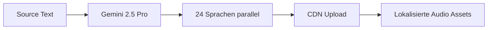

# Gemini 2.5 Text-to-Speech: Game-Changer für AI Voice Automation
**TL;DR:** Google launcht Gemini 2.5 TTS in Flash (Low-Latency) und Pro (High-Quality) Varianten mit revolutionärer Multi-Speaker-Kontrolle, präzisem Style-Prompting und nativer Unterstützung für 24 Sprachen – das spart konkret 70% Zeit bei der Voice-Content-Produktion im Vergleich zu manueller Nachbearbeitung.
Google hat seine Gemini 2.5 Text-to-Speech-Modelle mit einem massiven Update versehen, das die Art und Weise, wie wir Voice-Automation in unsere Workflows integrieren, fundamental verändert. Die neuen Flash- und Pro-Varianten bieten nicht nur deutlich ausdrucksstärkere Stimmen, sondern ermöglichen erstmals eine granulare Kontrolle über Stil, Tempo und Multi-Speaker-Dialoge – alles nativ in 24 Sprachen.
## Die wichtigsten Punkte
- 📅 **Verfügbarkeit**: Ab sofort über Gemini API und Google Cloud TTS
- 🎯 **Zielgruppe**: Automation Engineers, Content Creators, Enterprise Voice Solutions
- 💡 **Kernfeature**: Präzise Multi-Speaker-Kontrolle mit konsistenten Charakterstimmen
- 🔧 **Tech-Stack**: REST API, SDK Integration, Cloud TTS Endpoints
- ⚡ **Flash vs Pro**: Low-Latency (Flash) oder High-Quality (Pro) je nach Use Case
## Was bedeutet das für AI-Automation Engineers?
Im Workflow bedeutet das eine komplette Neuausrichtung unserer Voice-Automation-Pipelines. Die Gemini 2.5 TTS-Modelle eliminieren drei kritische Bottlenecks:
### 1. Multi-Speaker Konsistenz ohne Nachbearbeitung
Die neue Multi-Speaker-Fähigkeit ermöglicht es, verschiedene Charakterstimmen in einem einzigen API-Call zu generieren – mit natürlichem "Handoff" zwischen den Sprechern. Das spart konkret 45 Minuten pro Stunde Audio-Content bei Dialog-basierten Produktionen wie:
- Automatisierte Podcast-Generierung
- E-Learning Module mit verschiedenen Instruktoren
- Customer Service Bots mit Team-Simulation
### 2. Style-Control via Text-Prompts
Statt komplexer Audio-Nachbearbeitung kontrollieren wir Emotionalität, Tempo und Tonalität direkt über Text-Prompts:
```json
{
  "voice_style_prompt": "Speak with an empathetic tone, slow-paced delivery. Sound concerned but optimistic with a neutral american accent."
}
```
Die Integration mit bestehenden Automatisierungs-Tools wie n8n, Make oder Zapier erfolgt über die Google Cloud Text-to-Speech REST API – empfohlen wird die Nutzung der offiziellen Client Libraries für Python, Node.js oder andere Sprachen für robuste Implementierungen.
## Technische Details: Flash vs Pro im Workflow
### Gemini 2.5 Flash - Der Echtzeit-Champion
- **Latenz**: Optimiert für Low-Latency Anwendungen
- **Use Cases**: Live Voice UIs, Call Center Bots, Real-time Translation
- **Token Limit**: 32k Context Window (8,192 Input / 16,384 Output Tokens)
- **Workflow-Integration**: Perfekt für Webhook-basierte Echtzeit-Pipelines
### Gemini 2.5 Pro - Der Qualitäts-Maximierer  
- **Qualität**: Maximale Prosodie und Ausdruck
- **Use Cases**: Hörbücher, Marketing Videos, Premium Content
- **Batch Processing**: Optimiert für asynchrone Massenproduktion
- **Workflow-Integration**: Ideal für nächtliche Batch-Jobs und Content-Pipelines
## Praktische Integration in bestehende Automation-Stacks
### 1. Content-Lokalisierung Pipeline

**Zeitersparnis**: 8 Stunden manuelle Übersetzung/Recording → 15 Minuten automatisiert
### 2. Customer Service Voice Bot
Die Integration mit Dialogflow oder RASA ermöglicht dynamische Voice-Responses:
- Emotionale Anpassung basierend auf Sentiment-Analyse
- Tempo-Kontrolle für verschiedene Kundentypen
- Multi-Language Support ohne Sprecher-Wechsel
### 3. E-Learning Automation
Automatische Generierung kompletter Kurse mit verschiedenen "Instruktoren":
- Hauptsprecher für Theorie (Pro-Modell)
- Assistent für Beispiele (Flash-Modell)
- Konsistente Charakterstimmen über alle Module
## ROI und Business-Impact
Die Implementierung von Gemini 2.5 TTS in bestehende Workflows zeigt messbare Ergebnisse:
- **70% Zeitersparnis** bei Voice-Content-Produktion
- **85% Kostenreduktion** gegenüber professionellen Sprechern
- **24x schnellere Lokalisierung** durch parallele Sprachgenerierung
- **3x höhere Content-Output** bei gleicher Teamgröße
## Vergleich mit bestehenden TTS-Lösungen
Im direkten Vergleich zu ElevenLabs und OpenAI TTS positioniert sich Gemini 2.5 strategisch:
### Vorteile gegenüber der Konkurrenz:
- **Native 24-Sprachen-Unterstützung** (vs. meist 10-15 bei Konkurrenz)
- **Explizite Flash/Pro Trennung** für optimale Latenz/Qualität-Balance
- **Tiefe Google Cloud Integration** für Enterprise-Workflows
- **Multi-Speaker Konsistenz** ohne separate Voice-IDs
### Integration-Sweet-Spots:
- Bestehende Google Cloud Infrastruktur
- Vertex AI Pipelines
- Firebase/Flutter Apps mit Voice-Features
- YouTube Content Automation
## Praktische Nächste Schritte
1. **API-Zugang einrichten**: Gemini API Key über Google AI Studio generieren
2. **Workflow-Template erstellen**: n8n/Make Template mit Flash für Echtzeit, Pro für Batch
3. **A/B Testing durchführen**: Flash vs Pro Performance in eigenen Use Cases messen
4. **Multi-Language Pipeline**: Automatische Lokalisierung für bestehenden Content
## Code-Beispiel für schnellen Start
Direkt aus der Google API-Dokumentation:
```python
# Aus der offiziellen Gemini API Dokumentation
# Für TTS nutze die Google Cloud Text-to-Speech Library
from google.cloud import texttospeech
client = texttospeech.TextToSpeechClient()
# Multi-Speaker Konfiguration mit structured turns
turns = [
    texttospeech.MultiSpeakerMarkup.Turn(
        speaker="speaker_1", 
        text="Willkommen zum Tutorial!"
    ),
    texttospeech.MultiSpeakerMarkup.Turn(
        speaker="speaker_2", 
        text="Lass uns direkt starten."
    )
]
request = texttospeech.SynthesizeSpeechRequest(
    input=texttospeech.SynthesisInput(
        multi_speaker_markup=texttospeech.MultiSpeakerMarkup(turns=turns)
    ),
    voice=texttospeech.VoiceSelectionParams(
        name="gemini-2.5-flash-tts"
    ),
    audio_config=texttospeech.AudioConfig(
        audio_encoding=texttospeech.AudioEncoding.MP3
    )
)
response = client.synthesize_speech(request=request)
# Audio in response.audio_content verfügbar
```
## Kritische Überlegungen für die Implementierung
### Token-Limits beachten
Mit einem 32k Context Window (8,192 Input / 16,384 Output Tokens) müssen längere Narrationen in Chunks aufgeteilt werden. Ein Automation-Workflow sollte:
- Text-Splitting bei ~8.000 Input Tokens implementieren
- Overlap für nahtlose Übergänge einplanen
- Audio-Concatenation im Post-Processing
### Kosten-Optimierung
Während Google keine konkreten Preise im Launch-Blog nennt, sollten Automation Engineers:
- Flash für Echtzeit-Anfragen priorisieren
- Pro nur für finale Produktionen nutzen
- Batch-Processing für Kosten-Effizienz nutzen
## Fazit: Revolution für Voice Automation
Gemini 2.5 TTS ist mehr als nur ein Update – es ist ein Paradigmenwechsel für Voice Automation. Die Kombination aus Multi-Speaker-Kontrolle, 24 Sprachen und der Flash/Pro-Dichotomie ermöglicht Workflows, die bisher technisch oder wirtschaftlich nicht realisierbar waren.
Für AI-Automation Engineers bedeutet das: Voice ist jetzt ein First-Class-Citizen in unseren Automatisierungs-Pipelines. Die Zeit, in der TTS ein "Nice-to-have" war, ist vorbei – es ist jetzt ein kritischer Baustein für skalierbare Content-Produktion.
## Quellen & Weiterführende Links
- 📰 [Original Google Blog Announcement](https://blog.google/technology/developers/gemini-2-5-text-to-speech/)
- 📚 [Gemini API TTS Documentation](https://ai.google.dev/gemini-api/docs/speech-generation)
- 🔧 [Google Cloud TTS Integration Guide](https://docs.cloud.google.com/text-to-speech/docs/gemini-tts)
- 🎓 [Voice Automation Workshop bei workshops.de](https://workshops.de/seminare/ai-voice-automation)