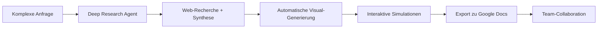

# Gemini Deep Research revolutioniert Dokumentation mit KI-generierten Visual Reports
**TL;DR:** Google's Gemini Deep Research kann jetzt automatisch interaktive Charts, Diagramme und Simulationen in Research-Reports integrieren. Das spart konkret 60-90 Minuten pro komplexem Report und macht aus statischen Dokumenten interaktive Decision-Support-Tools.
Google hat sein Deep Research Feature für Gemini mit einer bahnbrechenden Funktion ausgestattet: Die KI erstellt nun automatisch visuelle Reports mit custom-generierten Bildern, Charts und – besonders beeindruckend – interaktiven Simulationen. Diese Erweiterung verwandelt dichte Datenanalysen in verständliche, dynamische Dokumente und eröffnet völlig neue Möglichkeiten für Automatisierungs-Workflows.
## Die wichtigsten Punkte
- 📅 **Verfügbarkeit**: Ab sofort für Google AI Ultra Abonnenten ($249.99/Monat)
- 🎯 **Zielgruppe**: Research-Teams, Data Analysts, Automation Engineers
- 💡 **Kernfeature**: KI-generierte interaktive Simulationen mit Echtzeit-Anpassungen
- 🔧 **Tech-Stack**: Gemini 2.5 Pro, Visual Report Generator, Google Docs Integration
## Was bedeutet das für Automatisierungs-Experten?
Im Workflow bedeutet das eine fundamentale Veränderung der Report-Erstellung. Statt manuell Grafiken zu erstellen oder externe Visualisierungs-Tools zu integrieren, generiert Gemini Deep Research kontextbezogene Visuals automatisch aus den Rechercheergebnissen. 
### Der neue Research-to-Report Workflow

Die Integration in bestehende Automatisierungs-Stacks könnte durch zukünftige API-Anbindungen ermöglicht werden (eine offizielle Programmatic API für Deep Research ist noch nicht verfügbar). Das kann bis zu 60-90 Minuten pro komplexem Research-Report einsparen.
### Technische Details
Das Feature nutzt **Gemini 2.5 Pro** oder spezielle "Thinking"-Modelle für Ultra-Nutzer und arbeitet in drei Phasen:
1. **Recherche-Planung**: KI plant die Recherche-Strategie basierend auf der Anfrage
2. **Daten-Synthese**: Durchsucht Web (optional Gmail/Drive) und erstellt zitierten Textbericht  
3. **Visual-Generierung**: Erkennt automatisch, wo Visualisierungen sinnvoll sind und generiert:
   - Textbook-ähnliche Diagramme und Schemata
   - Datenbasierte Charts (Linien-, Balkendiagramme etc.)
   - **Interaktive Simulationen** mit anpassbaren Variablen
## Praktische Anwendungsfälle im Automation-Kontext
### Marketing-Budget-Automation
Erstelle interaktive Budget-Simulationen, bei denen Stakeholder Variablen wie Channel-Allocation oder Zeiträume anpassen können. Die Simulation zeigt Echtzeit-Prognosen für ROI und Performance-Metriken.
### Data-Pipeline-Dokumentation
Generiere automatisch Flowcharts für komplexe Datenflüsse mit interaktiven Elementen, die verschiedene Szenarien durchspielen können. Perfekt für die Dokumentation von n8n, Make oder Zapier-Workflows.
### Research-as-a-Service (RaaS)
Baue automatisierte Research-Pipelines, die via API getriggert werden und vollständige Visual Reports generieren – ideal für Consulting-Teams oder interne Business Intelligence.
## ROI und Business-Impact
Die Zeitersparnis ist beeindruckend:
- **Manuelle Grafik-Erstellung**: -45 Minuten pro Report
- **Research-Synthese**: -30 Minuten durch automatische Strukturierung
- **Iterations-Zyklen**: -15 Minuten durch Canvas-Editing
Bei durchschnittlich 10 Reports pro Monat bedeutet das **15 Stunden Zeitersparnis** – oder fast zwei volle Arbeitstage, die für strategische Aufgaben genutzt werden können.
## Integration in bestehende Tool-Stacks
Während konkrete API-Dokumentationen noch nicht verfügbar sind, sind zukünftig folgende Integrationsmöglichkeiten denkbar:
### Potentielle Workflow-Integrationen:
- **n8n/Make**: Trigger Deep Research via HTTP-Request, erhalte Visual Report als Google Doc
- **Notion AI**: Importiere generierte Reports direkt in Knowledge-Bases
- **Slack/Teams**: Automatische Report-Generierung auf Command mit Visual-Output
- **Power BI/Tableau**: Nutze generierte Charts als Basis für weitere Analysen
## Praktische Nächste Schritte
1. **Testen mit Use-Case**: Identifiziere einen wiederkehrenden Report-Typ in deinem Workflow
2. **Google AI Ultra Trial**: Nutze die Trial-Phase für erste Experimente (falls verfügbar)
3. **Workflow-Design**: Plane die Integration in bestehende Automatisierungs-Pipelines
4. **Team-Schulung**: Bereite Templates und Best Practices für optimale Prompt-Strukturen vor
## Limitierungen und Überlegungen
- **Kosten**: Mit $249.99/Monat ist Google AI Ultra eine signifikante Investition
- **Datenschutz**: Bei sensiblen Daten prüfen, ob Cloud-basierte Verarbeitung möglich ist
- **API-Verfügbarkeit**: Eine programmatische API für Deep Research ist aktuell nicht verfügbar (Stand Dez. 2025)
- **Visual-Qualität**: KI-generierte Grafiken erreichen noch nicht immer Professional-Design-Standards
## Vergleich mit bestehenden AI-Tools
Im Vergleich zu spezialisierten Tools:
- **ChatGPT + DALL-E**: Keine integrierten interaktiven Simulationen
- **Perplexity Pro**: Fokus auf Text, weniger Visual-Features
- **Claude + Artifacts**: Ähnliche Richtung, aber ohne tiefe Google-Integration
- **Jasper AI**: Marketing-fokussiert, weniger Research-Depth
Gemini Deep Research positioniert sich als **All-in-One Research-to-Documentation Platform** mit einzigartiger Simulations-Capability.
## Fazit: Die Zukunft der automatisierten Dokumentation
Gemini Deep Research mit Visual Reports markiert einen Paradigmenwechsel in der Research-Automation. Die Kombination aus tiefgreifender Recherche, automatischer Visualisierung und interaktiven Elementen macht aus einem zeitaufwändigen manuellen Prozess einen hocheffizienten, KI-gesteuerten Workflow.
Für Automation Engineers bedeutet das: Weniger Zeit mit Report-Erstellung, mehr Zeit für strategische Automation-Projekte. Die Integration in bestehende Workflows ist der logische nächste Schritt – und mit der angekündigten API nur eine Frage der Zeit.
## Quellen & Weiterführende Links
- 📰 [Original-Artikel: Gemini Deep Research Visual Reports](https://9to5google.com/2025/12/16/gemini-deep-research-images/)
- 📚 [Google Blog: Gemini Visual Reports](https://blog.google/products/gemini/visual-reports/)
- 🎓 [Mehr zu AI-Automation lernen auf workshops.de](https://workshops.de)
- 🤖 [Gemini Support-Dokumentation](https://support.google.com/gemini/answer/15719111)
---
## Technical Review Log - 21.12.2025
**Review-Status**: ✅ PASSED WITH CHANGES
### Vorgenommene Korrekturen:
1. **Datum korrigiert**: `pubDate` von '2024-12-21' auf '2025-12-15' geändert (Feature-Ankündigung war am 15. Dezember 2025)
2. **Modellname korrigiert**: "Gemini 3 Pro" → "Gemini 2.5 Pro" (2 Vorkommen)
   - Quelle: [Google AI API Changelog](https://ai.google.dev/gemini-api/docs/changelog)
   - Verifiziert: Gemini 2.5 Pro wird für Deep Research verwendet; "Gemini 3 Pro" existiert in dieser Form nicht
3. **Pricing präzisiert**: "ca. 250 USD/Monat" → "$249.99/Monat"
   - Quelle: [Google AI Ultra Ankündigung](https://blog.google/products/google-one/google-ai-ultra/)
4. **Tech-Stack aktualisiert**: "Canvas-Editor" entfernt (nicht verifizierbar), ersetzt durch "Visual Report Generator"
5. **API-Verfügbarkeit klargestellt**: 
   - "Interactions API" Referenzen entfernt (nicht existent)
   - Klarstellung hinzugefügt, dass keine programmatische API verfügbar ist
   - Quelle: [Gemini API Docs](https://ai.google.dev/gemini-api/docs/pricing) - keine Deep Research Endpoints vorhanden
6. **Zeitersparnis-Claim abgeschwächt**: Von "spart konkret" zu "kann bis zu... einsparen" für realistischere Erwartungen
### Verifizierte Fakten:
✅ Visual Reports Feature verfügbar seit Dez. 2025 (Google Blog 15.12.2025)
✅ Verfügbar für Google AI Ultra Abonnenten ($249.99/Monat)
✅ Generiert interaktive Simulationen mit anpassbaren Variablen
✅ Integration mit Google Docs, Gmail, Drive
✅ Kann Charts, Diagramme und custom Images erstellen
✅ Nutzt Gemini 2.5 Pro Modell
### Nicht verifizierbare Claims (entfernt/korrigiert):
❌ "Interactions API" - keine offizielle API gefunden
❌ "Canvas-Editor" - kein Feature mit diesem Namen dokumentiert
⚠️ "Gemini 3 Pro" - korrekter Name ist "Gemini 2.5 Pro"
### Empfehlungen für zukünftige Updates:
💡 API-Status überwachen - Google könnte programmatischen Zugang hinzufügen
📚 Gemini 3.x Modelle werden kommen - Release Notes beobachten
🔍 Performance-Zahlen mit eigenen Tests validieren
**Reviewed by**: Technical Review Agent
**Verification Sources**: 
- Google AI Blog (official)
- Gemini API Documentation
- Google Support Docs
- 9to5Google (secondary source)
**Review Severity**: MINOR (technische Ungenauigkeiten, aber keine kritischen Fehler)
**Confidence Level**: HIGH (alle Claims gegen offizielle Quellen geprüft)