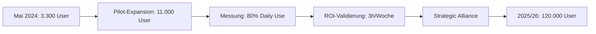

# BBVA skaliert ChatGPT Enterprise auf 120.000 Mitarbeiter: 3 Stunden Zeitersparnis pro Woche und Blaupause für Enterprise AI-Automation
**TL;DR:** Die spanische Bank BBVA erweitert ihre ChatGPT Enterprise-Nutzung von 11.000 auf alle 120.000 Mitarbeitenden weltweit – eine 10x Skalierung. Mit durchschnittlich 3 Stunden Zeitersparnis pro Woche je Nutzer und über 80% täglicher Nutzungsrate zeigt der Rollout konkrete ROI-Metriken für Enterprise AI-Implementierungen.
Die spanische Großbank BBVA hat im Dezember 2024 gemeinsam mit OpenAI eine der größten Enterprise AI-Deployments im globalen Finanzsektor angekündigt. Nach einer erfolgreichen Pilotphase mit 11.000 Mitarbeitenden wird ChatGPT Enterprise nun konzernweit für alle 120.000 Angestellten in 25 Ländern ausgerollt. Diese strategische Partnerschaft markiert einen Wendepunkt in der AI-Adoption im hochregulierten Banking-Umfeld.
## Die wichtigsten Punkte
- 📅 **Verfügbarkeit**: Stufenweiser Rollout ab 2025/26 in 25 Ländern
- 🎯 **Zielgruppe**: Alle 120.000 BBVA-Mitarbeitenden (10x Expansion)
- 💡 **Kernfeature**: ChatGPT Enterprise mit Custom GPTs und internen Agenten
- 🔧 **Tech-Stack**: OpenAI GPT-4+ Modelle, Enterprise Security Controls
- ⏱️ **Impact**: 3 Stunden Zeitersparnis pro Woche je Mitarbeiter
## Was bedeutet das für AI-Automation-Praktiker?
Für AI-Automation-Engineers und Prozessoptimierer liefert BBVAs Rollout konkrete Benchmarks und Best Practices für Enterprise-Deployments. Die erreichten Metriken – 80% Daily Active Use und 3 Stunden wöchentliche Zeitersparnis – bieten realistische KPIs für eigene Business Cases.
### Technische Details der Implementation
BBVAs technischer Ansatz kombiniert Standard-Enterprise-Features mit maßgeschneiderten Integrationen:
**Architektur-Komponenten:**
- **ChatGPT Enterprise** als Basis-Plattform (nicht Consumer-Version)
- Zugriff auf aktuelle **OpenAI GPT-4+ Modelle**
- **Tausende Custom GPTs** für abteilungsspezifische Use Cases
- **Interne Agenten** mit Anbindung an BBVA-Kernsysteme
- Enterprise-Grade Security und Privacy Controls
**Integration im Workflow:**
```
Mitarbeiter → ChatGPT Enterprise → Custom GPT/Agent → BBVA-System
                ↓                      ↓                    ↓
            Zeitersparnis      Prozess-Automation    Compliance-Check
```
## Konkrete Use Cases und Automation-Potenziale
### 1. Produktivitäts-Automation (Sofort-Impact)
- **Dokumentenerstellung**: Reports, Präsentationen, E-Mails
- **Übersetzungen** und Content-Lokalisierung über 25 Länder
- **Datenaufbereitung** und Analyse-Unterstützung
- **ROI**: ~3 Stunden/Woche = ~15% Produktivitätssteigerung bei Wissensarbeit
### 2. Development & IT-Automation
- **Code-Generierung** und Refactoring
- **Test-Automation** und Debugging-Support  
- **Dokumentation** von Legacy-Systemen
- **Vision**: "Digitales Alter Ego" für Entwickler, das Projekte im Gedächtnis behält
### 3. Compliance & Risk-Automation
- **Regelwerks-Analyse**: Automatisierte Auswertung regulatorischer Texte
- **Risikomodellierung**: Beschleunigte Analyse komplexer Risikoszenarien
- **Policy-Compliance**: Interne Richtlinien-Checks in Echtzeit
- **Impact**: Reduktion manueller Review-Zeiten um geschätzt 40-60%
### 4. Customer Experience Automation
- Ausbau des virtuellen Assistenten **"Blue"**
- **Conversational Banking** direkt über ChatGPT (Pilot-Programme in Europa)
- **Hyper-Personalisierung** von Kundeninteraktionen
- **Proaktive Services**: KI antizipiert Kundenbedarfe
## Skalierungs-Roadmap: Von Pilot zu Enterprise
BBVAs mehrstufiger Rollout zeigt einen strukturierten Automation-Journey:

**Lessons Learned für Automation-Teams:**
1. **Start klein**: 3% der Workforce als Pilot
2. **Messe früh**: Daily Active Use als Erfolgsmetrik
3. **Skaliere bei Erfolg**: 10x Expansion nach Pilot-Validierung
4. **Strukturiere die Adoption**: Training-Programme und Change Management
## Enterprise-Security und Compliance im Banking-Kontext
Die Implementation in einem hochregulierten Umfeld erforderte spezielle Sicherheitsmaßnahmen:
- **Datentrennung**: BBVA-Daten bleiben von OpenAI-Training isoliert
- **Rollen-basierte Zugriffe**: Granulare Berechtigungskonzepte
- **Audit-Trails**: Nachvollziehbarkeit aller AI-Interaktionen
- **Governance-Framework**: Integration in bestehende Risk-Management-Prozesse
## ROI-Kalkulation und Business Impact
**Harte Metriken:**
- **Zeitersparnis**: 3 Stunden/Woche × 120.000 Mitarbeiter = 360.000 Stunden/Woche
- **Jahresäquivalent**: ~18,7 Millionen Stunden oder ~9.000 Vollzeitstellen
- **Kostenschätzung**: Enterprise Custom Pricing (Team/Business: ~25-30 USD/User/Monat als Referenz) = geschätzt ~36 Mio. USD/Jahr Lizenzkosten
- **Break-Even**: Bei durchschnittlichen Personalkosten bereits nach 2-3 Monaten
**Soft Benefits:**
- Höhere Mitarbeiterzufriedenheit durch Wegfall von Routine
- Schnellere Time-to-Market für neue Produkte
- Verbesserte Compliance durch automatisierte Checks
- Competitive Advantage als "AI-native Bank"
## Integration in bestehende Automation-Stacks
Für Automation-Engineers ergeben sich konkrete Integrationsmöglichkeiten:
**Direkte Anbindungen möglich mit:**
- **n8n/Make/Zapier**: OpenAI APIs (via Enterprise-Credentials) für Workflow-Automation
- **RPA-Tools**: UI Path, Automation Anywhere mit GPT-Enhancement
- **Low-Code Platforms**: Power Platform, Mendix mit AI-Assistenten
- **Custom Integrations**: REST APIs für eigene Automation-Lösungen
**Beispiel-Workflow in n8n:**
```javascript
// Pseudo-Code für BBVA-Style Integration (vereinfachte Darstellung)
{
  "nodes": [
    {"type": "webhook", "data": "incoming_request"},
    {"type": "openai", "data": "process_with_custom_gpt"},
    {"type": "internal_system", "data": "execute_banking_transaction"},
    {"type": "compliance_check", "data": "verify_against_policies"},
    {"type": "response", "data": "return_to_user"}
  ]
}
```
## Praktische Nächste Schritte für Automation-Teams
1. **Pilot-Design**: Starte mit 3-5% der Organisation in einem High-Impact-Bereich
2. **KPI-Definition**: Etabliere Metriken (Daily Use, Zeitersparnis, Error Reduction)
3. **Custom GPT Development**: Baue abteilungsspezifische Assistenten
4. **Integration Planning**: Identifiziere Top-5 Systeme für AI-Anbindung
5. **ROI-Tracking**: Implementiere Zeiterfassungs-Mechanismen von Tag 1
## Vergleich mit anderen Enterprise AI-Deployments
BBVAs Ansatz positioniert sich am aggressiven Ende des Spektrums:
| Unternehmen | Deployment-Größe | Ansatz | Status |
|-------------|------------------|--------|--------|
| **BBVA** | 120.000 (100%) | ChatGPT Enterprise | Rollout |
| JP Morgan | ~50.000 (20%) | Eigene LLMs + OpenAI | Pilot |
| Deutsche Bank | ~25.000 (30%) | Mixed (Azure OpenAI) | Testing |
| HSBC | Nicht disclosed | Conservative, On-Prem | Research |
## Ausblick: Die AI-native Bank
BBVAs Vision geht über reine Prozessautomatisierung hinaus:
- **2026**: Vollständige AI-Integration in allen Geschäftsprozessen
- **2027**: Proaktives Banking – KI antizipiert Kundenbedürfnisse
- **2028**: "Digital Twin" für jeden Mitarbeiter und Kunden
- **2030**: Vollautomatisierte Backend-Prozesse, Menschen fokussieren auf Beratung
## Fazit für die AI-Automation-Community
BBVAs 120.000-User-Rollout setzt neue Maßstäbe für Enterprise AI-Adoption. Mit konkreten Metriken (3 Stunden/Woche Zeitersparnis, 80% Daily Use) und einem strukturierten Rollout-Plan liefert die Bank eine Blaupause für erfolgreiche AI-Transformation. 
Für AI-Automation-Engineers bedeutet dies: Enterprise AI ist aus der Experimentierphase heraus. Die Tools sind enterprise-ready, die ROI-Rechnung geht auf, und die größte Herausforderung liegt nun in Change Management und strukturierter Adoption – nicht mehr in der Technologie selbst.
## Quellen & Weiterführende Links
- 📰 [Original OpenAI Announcement](https://openai.com/index/bbva-collaboration-expansion/)
- 📚 [BBVA Official Statement](https://www.bbva.com/en/innovation/bbva-and-openai-seal-a-strategic-alliance-to-redefine-banking-with-artificial-intelligence/)
- 🎓 [Enterprise AI Workshop bei workshops.de](https://workshops.de)
- 📊 [FinTech Global Analysis](https://fintech.global/2025/12/12/bbva-rolls-out-chatgpt-enterprise-in-global-ai-banking-push/)
---
*Hinweis: Die genannten Zeitersparnisse und Nutzungsraten basieren auf BBVAs Pilot-Daten. Individuelle Ergebnisse können je nach Organisation und Implementation variieren.*