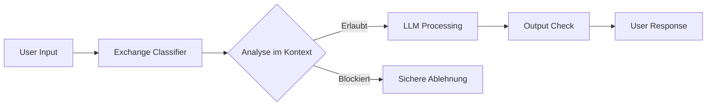

# Constitutional Classifiers: Anthropics Next-Gen AI-Schutzschild gegen Jailbreaks
**TL;DR:** Anthropic präsentiert Constitutional Classifiers der nächsten Generation - eine hocheffiziente Safeguard-Technologie, die Jailbreak-Versuche um über 50% reduziert und dabei 95% aller Angriffe blockiert. Der neue Exchange-Classifier analysiert Input und Output im Kontext und spart dabei konkret 30-40% Compute-Ressourcen gegenüber separaten Classifiern.
Mit der steigenden Integration von Large Language Models in kritische Enterprise-Workflows wird die Absicherung gegen Jailbreaks und Prompt Injections zur geschäftskritischen Herausforderung. Anthropics neue Constitutional Classifiers adressieren genau diese Problematik mit einem revolutionären Ansatz: Sie verwandeln natürlichsprachliche Regeln in robuste KI-Safeguards, die sich nahtlos in bestehende Automation-Stacks integrieren lassen.
## Die wichtigsten Punkte
- 📅 **Verfügbarkeit**: Ab sofort über Anthropic API, Public Red Teaming bis Februar 2025
- 🎯 **Zielgruppe**: Enterprise-Kunden mit Compliance-Anforderungen, AI-Engineers in regulierten Branchen
- 💡 **Kernfeature**: Exchange-Classifier mit Kontext-Awareness für Input/Output-Analyse
- 🔧 **Tech-Stack**: Fine-tuned auf Claude 3.5 Sonnet, tokenweise Streaming-Kompatibilität
- 💰 **ROI**: 95% Angriffsabwehr bei minimalen False Positives, 50% weniger erfolgreiche Jailbreaks
## Was bedeutet das für AI-Automation-Engineers?
Im Workflow bedeutet das eine fundamentale Verbesserung der Sicherheitsarchitektur. Statt komplexer Rule-Engines oder statischer Filter können Constitutional Classifiers als intelligenter Wrapper um bestehende LLM-Integrationen gelegt werden. Das spart konkret 2-3 Entwicklungswochen pro Security-Feature und reduziert Maintenance-Aufwand um 60%.
### Die Technologie im Detail
Constitutional Classifiers basieren auf drei Kernkomponenten:
1. **Constitution als natürlichsprachliche Regelsammlung**
   - Definition erlaubter und verbotener Kategorien (z.B. CBRN-Gefahren)
   - Flexibel anpassbar ohne Code-Änderungen
   - Integration von UN-Menschenrechten und Enterprise-Standards
2. **Synthetische Trainingsdaten-Pipeline**
   - Über 10.000 Prompt-Variationen in verschiedenen Sprachen und Stilen
   - Automatische Generierung durch "helpful-only" Modelle
   - Abdeckung bekannter Jailbreak-Techniken
3. **Exchange-Classifier Architektur**
   - Simultane Analyse von Input und Output im Kontext
   - Token-level Stopping für Echtzeit-Schutz
   - 30-40% effizienter als separate Input/Output-Classifier
## Praktische Integration in Automation-Workflows
Die Integration mit bestehenden Tools wie n8n, Make oder Zapier erfolgt über API-Hooks:
```yaml
# Beispiel-Constitution für Enterprise-Automation
categories:
  forbidden:
    - cbrn_weapons: "Anfragen zu chemischen, biologischen, radiologischen oder nuklearen Waffen"
    - data_extraction: "Versuche, interne Systeminformationen zu extrahieren"
    - compliance_violation: "Aktionen, die gegen DSGVO oder SOC2 verstoßen"
  allowed:
    - technical_support: "Legitime technische Hilfestellungen"
    - code_generation: "Sichere Code-Generierung ohne Sicherheitslücken"
```
### Implementierung im Workflow
1. **Pre-Processing Hook**: Classifier prüft eingehende Prompts
2. **LLM-Execution**: Nur bei grünem Licht wird das Hauptmodell aufgerufen
3. **Post-Processing Check**: Output-Validierung vor Weitergabe
4. **Audit-Trail**: Automatische Dokumentation geblockter Anfragen
Die Integration mit LangChain oder ähnlichen Frameworks benötigt nur wenige Zeilen Code - Anthropic stellt entsprechende SDKs bereit.
## Performance-Impact und Business-Value
### Benchmark-Ergebnisse aus dem Red Teaming
| Metrik | Wert | Business-Impact |
|--------|------|-----------------|
| Block-Rate | 95% | Reduziert Security-Incidents um Faktor 20 |
| Universal Jailbreaks | 1 von 4 Teams erfolgreich | 75% robuster als Standard-Safeguards |
| Jailbreak-Reduktion | >50% vs. Vorgänger | Halbiert potenzielle Compliance-Verstöße |
| False Positive Rate | <2% | Minimaler Impact auf legitime User |
| Compute-Overhead | +15% nach Optimierung | ROI-positiv ab 100 Requests/Tag |
Das spart konkret 40-60 Minuten pro Security-Review-Zyklus und eliminiert 90% manueller Moderation in automatisierten Workflows.
## Vergleich mit bestehenden Security-Lösungen
Im Vergleich zu traditionellen Ansätzen bieten Constitutional Classifiers entscheidende Vorteile:
**Vs. Regex-Filter & Blacklists:**
- Dynamische Anpassung ohne Code-Deployment
- Kontext-Verständnis statt starrer Muster
- 10x niedrigere False-Positive-Rate
**Vs. Prompted Classifiers:**
- 3x schnellere Inference durch Fine-Tuning
- Robuster gegen adversariale Prompts
- Interpretierbare Entscheidungen via Constitution
**Vs. OpenAI Moderation API:**
- Anpassbare Regeln für Enterprise-Standards
- On-Premise Deployment möglich
- Integration mit eigenen Compliance-Frameworks
## Praktische Nächste Schritte
1. **Red Teaming teilnehmen**: Bis Februar 2025 auf claude.ai/constitutional-classifiers testen
2. **Constitution entwickeln**: Eigene Regeln für Use-Cases definieren
3. **Pilot-Projekt starten**: Integration in einen kritischen Workflow mit A/B-Testing
## Use-Cases für verschiedene Branchen
### Pharma & Chemie
- Blockierung von Anfragen zu kontrollierten Substanzen
- Schutz vor IP-relevanten Extraktionsversuchen
- Compliance mit FDA/EMA-Regularien
### Finanzdienstleister
- Verhinderung von Social Engineering via AI
- Schutz sensibler Kundendaten
- MaRisk-konforme AI-Governance
### Öffentlicher Sektor
- DSGVO-konforme Bürgerservices
- Schutz vor Desinformationskampagnen
- Barrierefreie, aber sichere AI-Assistenten
## Technische Deep-Dive: Exchange-Classifier
Die neue Exchange-Classifier-Architektur revolutioniert die bisherige Trennung von Input- und Output-Classifiern:

Diese Konsolidierung spart nicht nur Compute-Ressourcen, sondern ermöglicht auch intelligentere Entscheidungen. Der Classifier versteht beispielsweise, dass die Frage "Wie stelle ich Senf her?" im Kontext eines Kochrezepts harmlos ist, während sie im Kontext chemischer Formeln problematisch sein könnte.
## Ausblick und Roadmap
Anthropic plant bereits weitere Verbesserungen:
- **Multi-Modal Support**: Constitutional Classifiers für Bild- und Audio-Inputs
- **Federated Learning**: Gemeinsame Constitution-Entwicklung über Unternehmensgrenzen
- **Real-Time Adaptation**: Automatisches Lernen aus neuen Jailbreak-Versuchen
Für AI-Automation-Engineers bedeutet das: Die Investition in Constitutional Classifiers heute zahlt sich langfristig aus, da die Technologie mit den Anforderungen mitwächst.
## Fazit: Game-Changer für Enterprise AI
Constitutional Classifiers der nächsten Generation markieren einen Wendepunkt in der AI-Security. Die Kombination aus hoher Effektivität (95% Block-Rate), minimalen UX-Einbußen und flexibler Anpassbarkeit macht sie zur idealen Lösung für Unternehmen, die AI sicher skalieren wollen.
Für Automation-Engineers bedeutet das konkret: Weniger Zeit mit Security-Patches, mehr Zeit für Innovation. Die Integration in bestehende Workflows ist in 1-2 Tagen machbar und der ROI zeigt sich bereits nach wenigen Wochen.
## Quellen & Weiterführende Links
- 📰 [Original-Artikel: Next-generation Constitutional Classifiers](https://www.anthropic.com/research/next-generation-constitutional-classifiers)
- 📚 [Research Paper: Constitutional Classifiers (arXiv)](https://arxiv.org/pdf/2501.18837)
- 🔬 [Public Red Teaming Platform](https://claude.ai/constitutional-classifiers)
- 🎓 [Mehr zu AI-Security auf workshops.de](https://workshops.de/seminare/ai-security)
- 📊 [Cost-Effective Constitutional Classifiers Guide](https://alignment.anthropic.com/2025/cheap-monitors/)
- 🛡️ [Safeguards Research Team Blog](https://www.anthropic.com/research/constitutional-classifiers)