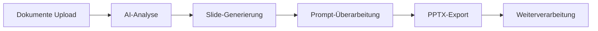

# NotebookLM Slides: Google macht Präsentations-Automatisierung prompt-basiert editierbar
**TL;DR:** Google erweitert NotebookLM um die Möglichkeit, generierte Präsentationen per Prompt zu überarbeiten und als PPTX zu exportieren. Das Feature steht Pro- und Ultra-Nutzern zur Verfügung und reduziert die Zeit von Recherche zu fertiger PowerPoint-Präsentation auf unter 2 Minuten.
Google hat seinem AI-Research-Tool NotebookLM ein bedeutendes Update spendiert, das besonders für Automatisierungs-Enthusiasten interessant ist: Generierte Slide-Decks können jetzt direkt per Text-Prompt überarbeitet und als PowerPoint-Datei exportiert werden. Das spart konkret 15-30 Minuten pro Präsentation im Vergleich zu manueller Nachbearbeitung.
## Die wichtigsten Punkte
- 📅 **Verfügbarkeit**: Ab sofort für Pro- und Ultra-Nutzer, weltweiter Rollout läuft
- 🎯 **Zielgruppe**: Knowledge Worker, Consultants, Automatisierungs-Experten
- 💡 **Kernfeature**: Prompt-basierte Überarbeitung + nativer PPTX-Export
- 🔧 **Tech-Stack**: Google Gemini AI-Modelle, nahtlose Google-Workspace-Integration
## Was bedeutet das für AI-Automation-Engineers?
Für Automatisierungs-Experten öffnet sich hier eine neue Dimension der Workflow-Optimierung. Statt den bisherigen Umweg über Canva, PowerPoint oder andere Design-Tools zu nehmen, ermöglicht NotebookLM jetzt einen durchgängigen automatisierten Prozess von der Quelldokumentation zur fertigen Präsentation.
### Technische Details
Das neue Feature arbeitet mit zwei Generierungsmodi:
1. **Detailed Deck**: Für umfangreiche, textlastige Berichte und Dokumentationen
2. **Presenter Slides**: Für visuelle, stichpunktbasierte Präsentationen
Die Überarbeitungs-Funktion generiert dabei keinen direkten Edit-Modus, sondern erstellt einen komplett neuen Slide-Deck basierend auf dem Prompt. Die Regenerierung dauert dabei nur etwa 50 Sekunden - deutlich schneller als die initiale Erstellung.
## Der Workflow im Detail

### Praktische Anwendungsszenarien
**1. Automatisierte Report-Erstellung**
Im Workflow bedeutet das: Lade deine Forschungsdaten, Meeting-Notizen oder Web-Clippings hoch, lass NotebookLM die Essenz extrahieren und generiere in unter 2 Minuten eine komplette Präsentation. Per Prompt kannst du dann spezifische Anpassungen vornehmen: "Füge mehr technische Details hinzu" oder "Mache es management-tauglicher".
**2. Integration in bestehende Automation-Stacks**
Die PPTX-Export-Funktion ermöglicht nahtlose Integration mit Tools wie:
- **n8n/Make/Zapier**: Automatischer Upload zu SharePoint/Google Drive
- **Python-Scripts**: Weiterverarbeitung der PPTX-Dateien
- **CI/CD-Pipelines**: Automatische Präsentations-Generierung aus Dokumentation
**3. Mobile-First Workflows**
Mit der vollständigen Synchronisation zwischen Desktop, Android und iOS können Präsentationen unterwegs erstellt und am Desktop finalisiert werden - perfekt für Consultants und Field Engineers.
## ROI und Business-Impact
Die Zeitersparnis ist konkret messbar:
| Traditioneller Workflow | NotebookLM Workflow | Zeitersparnis |
|------------------------|---------------------|---------------|
| Recherche: 30 min | Upload: 2 min | -28 min |
| Struktur: 20 min | AI-Analyse: 1 min | -19 min |
| Design: 45 min | Generierung: 2 min | -43 min |
| Überarbeitung: 30 min | Prompt-Edit: 50 sek | -29 min |
| **Gesamt: 125 min** | **Gesamt: 6 min** | **-119 min (95%)** |
## Limitierungen und Ausblick
Aktuell fehlt noch:
- Direkter Google Slides Export (in Entwicklung)
- Granulare Slide-by-Slide Bearbeitung
- API-Zugriff für vollständige Automatisierung
Google plant bereits die Integration mit Google Slides und weitere Gemini-basierte Features. Für Automation Engineers bedeutet das: Der Grundstein für vollautomatisierte Präsentations-Pipelines ist gelegt.
## Praktische Nächste Schritte
1. **Test-Setup erstellen**: NotebookLM Pro/Ultra Account einrichten und erste Automatisierungs-Tests durchführen
2. **Workflow-Integration planen**: Bestehende Dokumentations-Prozesse identifizieren, die von automatischer Präsentations-Generierung profitieren
3. **Prompt-Library aufbauen**: Sammlung effektiver Prompts für verschiedene Präsentationstypen anlegen
## Vergleich mit bestehenden AI-Tools
Im Vergleich zu anderen AI-Präsentationstools positioniert sich NotebookLM clever:
- **Gamma.app**: Bessere Design-Templates, aber kein PPTX-Export
- **Tome**: Schönere Animationen, aber teurer und weniger flexibel
- **Beautiful.ai**: Mehr Design-Kontrolle, aber keine Prompt-basierte Überarbeitung
- **ChatGPT + Canva**: Mehr Schritte, keine native Integration
NotebookLM punktet durch die nahtlose Google-Integration und den direkten PPTX-Export - essentiell für Enterprise-Umgebungen.
## Fazit für die AI-Automation-Community
Mit diesem Update macht Google NotebookLM zu einem ernstzunehmenden Player im Bereich der Präsentations-Automatisierung. Die Kombination aus AI-gestützter Recherche, Prompt-basierter Bearbeitung und nativem PowerPoint-Export schließt eine wichtige Lücke in vielen Automatisierungs-Workflows.
Für Teams, die bereits im Google-Ökosystem arbeiten, ist das ein No-Brainer. Die Integration mit bestehenden Automatisierungs-Tools wie Make oder n8n eröffnet komplett neue Möglichkeiten für die automatisierte Erstellung von Kundenpräsentationen, Reports und Dokumentationen.
## Quellen & Weiterführende Links
- 📰 [Original Twitter/X Announcement](https://x.com/notebooklm/status/2023851190102986970)
- 📚 [NotebookLM Offizielle Seite](https://notebooklm.google.com)
- 🎓 [AI-Automation-Workshops bei workshops.de](https://workshops.de/seminare/ai-automation)
- 📺 [Video-Tutorial zum Feature](https://www.youtube.com/watch?v=8BXQWJ-54mc)