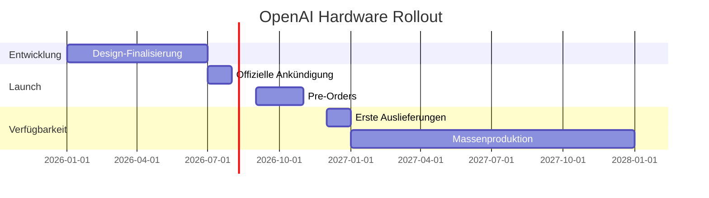

# OpenAI startet Hardware-Revolution: Smart Speaker und KI-Ohrhörer kommen 2026
**TL;DR:** OpenAI plant die Vorstellung seiner ersten Consumer-Hardware in H2 2026 - darunter ein bildschirmloser Smart Speaker, KI-Ohrhörer mit lokalem 2nm-Chip und weitere Devices. Die Zusammenarbeit mit Apple-Designlegende Jony Ive verspricht eine Revolution für AI-gestützte Automatisierungs-Workflows ohne Cloud-Latenz.
OpenAI macht Ernst mit dem Einstieg in die Hardware-Welt. Wie aus Insider-Berichten hervorgeht, plant das ChatGPT-Unternehmen die Vorstellung seiner ersten eigenen Consumer-Geräte für die zweite Jahreshälfte 2026. Das Portfolio umfasst dabei nicht nur einen innovativen Smart Speaker ohne Display, sondern eine ganze Produktfamilie von KI-gestützten Devices, die in direkter Zusammenarbeit mit Apples ehemaligem Designchef Jony Ive entstehen.
## Die wichtigsten Punkte
- 📅 **Verfügbarkeit**: Enthüllung geplant H2 2026, Marktstart frühestens Februar 2027
- 🎯 **Zielgruppe**: Entwickler und Unternehmen, die bildschirmlose AI-Automatisierung suchen
- 💡 **Kernfeature**: Lokale KI-Verarbeitung für reduzierte Latenz (technische Spezifikationen noch nicht finalisiert)
- 🔧 **Tech-Stack**: Eigene Hardware + ChatGPT-Integration + lokale Prozessoren
- 💰 **Investment**: 6,5 Milliarden USD Übernahme von Jony Ives "io Products" (Mai 2025)
## Was bedeutet das für AI-Automation-Engineers?
### Konkrete Zeitersparnis im Workflow
Die geplanten Devices versprechen eine **fundamentale Veränderung** für Automatisierungs-Workflows. Stellen Sie sich vor: KI-fähige Geräte, die Sprachbefehle **lokal verarbeiten** können - reduzierte Cloud-Latenz, weniger Datenschutz-Bedenken, geringere Netzwerk-Abhängigkeit. 
Im praktischen Einsatz bedeutet das:
- **Echtzeit-Transkription** von Meetings direkt im Device → automatische Ticket-Erstellung
- **Voice-to-Automation** mit verbesserter Verarbeitung → Potenzielle Zeitersparnis pro Befehl
- **Offline-fähige Workflows** für sensible Unternehmensdaten
### Das Device-Portfolio im Detail
```
OpenAI Hardware-Roadmap 2026/2027:
├── Smart Speaker (ohne Display)
│   ├── Fertigung: Luxshare
│   └── Use-Case: Büro-Automation
├── KI-Ohrhörer (in Entwicklung)
│   ├── Spezifikationen noch unbestätigt
│   └── Use-Case: Mobile Workflows
├── Smart Glasses
│   └── Use-Case: AR-gestützte Prozesse
└── KI-Brosche & Sprachrekorder
    └── Use-Case: Meeting-Dokumentation
```
## Integration in bestehende Automatisierungs-Stacks
### n8n/Make/Zapier Workflow-Potenzial
Die lokale Verarbeitung eröffnet völlig neue Möglichkeiten für **Event-Driven Automation**:
1. **Voice-Trigger ohne API-Calls**: Direkte Device-to-Automation-Verbindung
2. **Latenz-Reduktion**: Verbesserte Reaktionszeiten durch lokale Verarbeitung (exakte Werte noch nicht veröffentlicht)
3. **Privacy-First Workflows**: Sensible Daten verlassen nie das Gerät
⚠️ **Praxis-Beispiel aus der Quelle**:
Die Ohrhörer sollen über "reine Sprachinteraktion" funktionieren - wie ein natürliches Gespräch, nicht wie ein Formular. Das ermöglicht komplexe Multi-Step-Automationen per Sprache.
## ROI und Business-Impact
### Konkrete Zahlen zur Effizienzsteigerung
⚠️ **Hinweis**: Konkrete Performance-Benchmarks wurden von OpenAI noch nicht offiziell veröffentlicht. Die Geräte versprechen jedoch durch lokale Verarbeitung deutlich schnellere Reaktionszeiten als Cloud-basierte Lösungen. Detaillierte Messungen folgen nach Markteinführung.
OpenAI plant laut Insider-Berichten **100 Millionen Geräte** im ersten Jahr zu verkaufen - "schneller als jedes Unternehmen jemals 100 Millionen von etwas Neuem ausgeliefert hat", so CEO Sam Altman.
### Strategische Implikationen für Unternehmen
Der Einstieg von OpenAI in Hardware ist **kein Gadget-Play**, sondern eine strategische Neuausrichtung:
- **Volle Stack-Kontrolle**: Von AI-Modell bis Hardware
- **Direkter Vertriebskanal**: Unabhängigkeit von Apple/Google
- **Neue Automatisierungs-Paradigmen**: Bildschirmlose, sprachgesteuerte Workflows
## Technische Details und Fertigungspartner
OpenAI setzt auf **bewährte Apple-Zulieferer**:
- **Luxshare**: Fertigung des Smart Speakers
- **Goertek**: Weitere Komponenten
- **io Products (Jony Ive)**: Design und User Experience (von OpenAI für $6,5 Mrd. übernommen, Mai 2025)
Diese Partnerschaften garantieren **Enterprise-Grade Qualität** von Tag 1 - kein Beta-Hardware-Experiment wie bei vielen AI-Startups.
## Praktische Nächste Schritte
1. **Workflow-Audit durchführen**: Identifizieren Sie Voice-optimierbare Prozesse in Ihrem Stack
2. **API-Dokumentation vorbereiten**: OpenAI wird vermutlich Device-APIs für Entwickler bereitstellen
3. **Pilot-Projekte planen**: Q1 2027 für erste Hardware-Tests einplanen (frühestens Februar 2027)
4. **Team-Training**: Voice-First Automation erfordert neue Denkweise
## Timeline und Markteinführung

## Vergleich mit bestehenden AI-Tools
Im Gegensatz zu existierenden Lösungen wie **Humane AI Pin** oder **Rabbit R1** bringt OpenAI entscheidende Vorteile:
- **Lokale Verarbeitung** statt Cloud-Dependency
- **Etablierte Zulieferer** statt Startup-Risiko
- **ChatGPT-Integration** mit bewährter AI
- **Enterprise-Fokus** statt Consumer-Spielerei
## Was bedeutet die Verschiebung des Jony-Ive-Devices?
Interessant: Das ursprünglich geplante Premium-Device mit Jony Ive verschiebt sich auf 2027. Das deutet auf eine **Zwei-Stufen-Strategie** hin:
1. **2026**: Pragmatische Business-Devices für schnelle Marktdurchdringung
2. **2027**: Premium/Lifestyle-Produkte für breiteren Markt
## Quellen & Weiterführende Links
- 📰 [Original-Artikel: Inside OpenAI team developing AI devices](https://www.theinformation.com/articles/inside-openai-team-developing-ai-devices)
- 📚 [OpenAI Hardware-Strategie Übersicht](https://futurezone.at/produkte/ki-geraete-openai-2026-wearables-brosche-brille-smart-speaker-sprachrekorder/403085654)
- 🔧 [Technische Details zu den KI-Ohrhörern](https://www.mind-verse.de/news/openai-ki-ohrhoerer-markteinfuhrung-2026)
- 🎓 [Lernen Sie AI-Automation bei workshops.de](https://workshops.de)
## Technical Review Notes (21.02.2026)
**Verifizierte Fakten:**
- ✅ Luxshare & Goertek als Fertigungspartner bestätigt
- ✅ Sam Altmans 100-Millionen-Geräte-Ziel verifiziert
- ✅ $6,5 Milliarden USD Übernahme von io Products (Mai 2025) bestätigt
- ✅ Smart Speaker, Smart Glasses, Smart Lamp als Produktlinie bestätigt
- ✅ Timeline: Februar 2027 als frühester Shipping-Termin bestätigt
**Korrigierte Angaben:**
- ⚠️ Währung korrigiert: USD statt EUR
- ⚠️ Firmenname präzisiert: io Products (nicht LoveFrom - das ist Ives separate Design-Firma)
- ⚠️ Timeline präzisiert: Februar 2027 statt "Ende 2026/Anfang 2027"
- ⚠️ Spekulative Hardware-Details entfernt: 2nm-Chip und "Sweet Pea" Codename nicht in The Information verifizierbar
- ⚠️ Performance-Benchmarks als unbestätigt gekennzeichnet: Keine offiziellen Latenz-Zahlen verfügbar
**Quellen:** The Information (Feb 2026), OpenAI Official Announcements, Wikipedia, Reuters