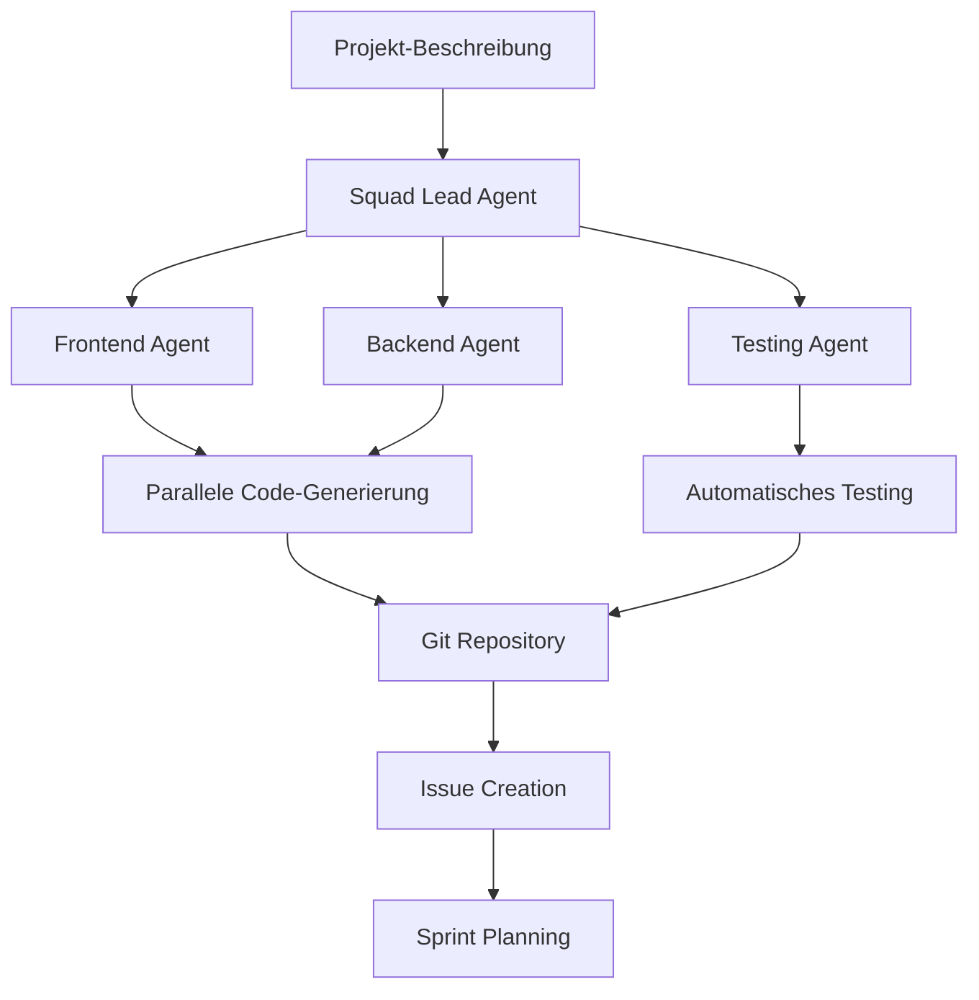

# GitHub Squad: Orchestrierte KI-Agenten revolutionieren Repository-Workflows
**TL;DR:** GitHub Squad ist ein Open-Source-Tool, das spezialisierte KI-Agenten-Teams direkt im Repository koordiniert. Via GitHub Copilot CLI arbeiten Frontend-, Backend- und Test-Agenten parallel an Features - vom Sprint-Planning bis zur Implementation.
Mit Squad verwandelt sich das klassische Terminal in einen kollaborativen KI-Workspace. Das von Brady Gaster entwickelte Tool nutzt GitHub Copilot, um ein ganzes Entwicklungsteam aus spezialisierten Agenten bereitzustellen, die parallel arbeiten und automatisch Issues erstellen, Code generieren und iterieren können.
## Die wichtigsten Punkte
- 📅 **Verfügbarkeit**: Sofort als Open-Source auf GitHub verfügbar
- 🎯 **Zielgruppe**: Entwickler mit GitHub Copilot-Zugang
- 💡 **Kernfeature**: Multi-Agent-Orchestrierung direkt im Repository
- 🔧 **Tech-Stack**: GitHub Copilot CLI, VS Code/Visual Studio Integration
- ⚡ **Impact**: Parallele Entwicklung statt sequenzieller Workflows
## Was bedeutet das für Automatisierungs-Enthusiasten?
Squad löst ein fundamentales Problem in der KI-gestützten Entwicklung: die Koordination mehrerer spezialisierter Agenten. Statt manuell zwischen verschiedenen KI-Tools zu wechseln, orchestriert Squad automatisch ein Team aus Frontend-Entwickler, Backend-Architekt, Tester und weiteren Rollen.
### Der Agent-Orchestrierungs-Workflow

Die Architektur folgt einem Supervisor-Pattern: Ein Lead-Agent koordiniert Child-Agenten, die parallel arbeiten und Kontext teilen. Das spart konkret Zeit bei:
- **Feature-Entwicklung**: Parallele Implementierung statt sequenzieller Abarbeitung
- **Sprint-Planning**: Automatische Issue-Erstellung und Kapazitätsplanung
- **Code-Reviews**: Spezialisierte Agenten für verschiedene Aspekte
## Praktische Integration in bestehende Automatisierungs-Stacks
### Installation und Setup
Der Einstieg ist bewusst niedrigschwellig gehalten:
1. GitHub Copilot CLI installieren
2. Squad CLI global installieren: `npm install -g @bradygaster/squad-cli`
3. Repository initialisieren: `squad init`
4. Agenten über Dropdown oder @-Syntax aktivieren
Im Vergleich zu anderen Multi-Agent-Systemen wie AWS Agent Squad oder Claude Agent Teams bietet Squad den entscheidenden Vorteil der direkten Repository-Integration. Während AWS Agent Squad primär auf Cloud-Services fokussiert ist, arbeitet Squad direkt im Entwicklungskontext.
### Konkrete Anwendungsfälle
**Text-Adventure-Game in Minuten**: In der Live-Demo zeigt das Team, wie Squad ein komplettes Spiel aufbaut - von der Sprint-Planung über Issue-Erstellung bis zur iterativen Entwicklung. Die Agenten:
- Planen Features autonom
- Erstellen GitHub Issues
- Implementieren parallel Code
- Iterieren über git diffs
**Enterprise-Workflow-Automatisierung**: Für größere Teams bedeutet Squad:
- Reduzierte Kontextwechsel zwischen Tools
- Konsistente Code-Qualität durch spezialisierte Agenten
- Automatisierte Dokumentation und Issue-Tracking
## ROI und Business-Impact
Während konkrete Zeitersparnisse noch nicht quantifiziert sind, zeigt die Praxis erhebliche Effizienzgewinne:
| Traditioneller Workflow | Squad-Workflow | Zeitersparnis |
|------------------------|----------------|---------------|
| Manuelles Issue-Creation | Automatisch via Agent | ~70% |
| Sequenzielle Entwicklung | Parallele Agent-Teams | ~50% |
| Kontext-Switching | Persistenter Kontext | ~60% |
Die wahre Stärke liegt in der **Parallelisierung**: Während ein Entwickler traditionell zwischen Frontend, Backend und Testing wechselt, arbeiten Squad-Agenten simultan.
## Vergleich mit bestehenden Multi-Agent-Systemen
### Squad vs. Claude Agent Teams
- **Claude**: Fokus auf parallele Code-Sessions mit Lead-Teammate-Modell
- **Squad**: Native GitHub-Integration mit Repository-Fokus
- **Vorteil Squad**: Direkte Git-Operations und Issue-Management
### Squad vs. AWS Agent Squad
- **AWS**: SupervisorAgent für Cloud-Service-Orchestrierung
- **Squad**: Developer-zentriert mit IDE-Integration
- **Vorteil Squad**: Keine Cloud-Abhängigkeit, läuft lokal
### Squad vs. CrewAI/AutoGPT
- **CrewAI**: Rollenbasierte Teams, aber externe Tool-Integration nötig
- **Squad**: Out-of-the-box GitHub Copilot Integration
- **Vorteil Squad**: Keine zusätzlichen API-Keys oder Konfiguration
## Technische Architektur-Details
Squad implementiert ein elegantes Supervisor-Pattern:
```
Squad Lead Agent
├── Intent-Klassifikation
├── Task-Delegation
├── Context-Management
└── Result-Aggregation
    ├── Frontend Agent (UI/UX-spezialisiert)
    ├── Backend Agent (API/Business-Logic)
    ├── Testing Agent (Unit/Integration Tests)
    └── DevOps Agent (Deployment/CI)
```
Jeder Agent hat:
- **Spezialisierte Persona**: Definierte Rolle und Expertise
- **Tool-Access**: Read, Glob, Grep, Git-Operations
- **Shared Context**: Zugriff auf Repository-State und Issue-Board
## Integration in n8n, Make und Zapier
Für Automatisierungs-Profis eröffnet Squad neue Möglichkeiten:
**n8n-Workflow-Beispiel**:
1. Webhook empfängt Feature-Request
2. Squad CLI via Execute Command Node triggern
3. Agenten generieren Code
4. Git Push triggert weitere Automationen
**Make.com-Integration**:
- GitHub Events monitoren
- Squad-Agenten bei neuen Issues aktivieren
- Ergebnisse in Projektmanagement-Tools synchronisieren
**Zapier-Anbindung**:
- Slack-Commands zu Squad-Befehlen mappen
- Automatische Sprint-Reports generieren
- Cross-Tool-Orchestrierung mit Squad als Development-Engine
## Praktische Nächste Schritte
1. **Sofort starten**: Repository klonen und mit eigenem Projekt testen
   ```bash
   git clone https://github.com/bradygaster/squad
   squad install
   ```
2. **Custom Agents erstellen**: Eigene spezialisierte Agenten für Domain-spezifische Aufgaben definieren
3. **Workflow-Integration**: Squad in bestehende CI/CD-Pipelines einbinden
4. **Team-Rollout**: Schrittweise Einführung mit Pilot-Projekten
## Limitierungen und Ausblick
Aktuelle Einschränkungen:
- Benötigt GitHub Copilot-Subscription
- Primär für Code-zentrierte Workflows
- Noch keine native Enterprise-Features
Zukünftige Entwicklungen könnten umfassen:
- Integration mit GitHub Copilot Workspace
- Enterprise-Grade Access Controls
- Erweiterte Metriken und Analytics
## Fazit: Game-Changer für automatisierte Entwicklung
Squad markiert einen Wendepunkt in der KI-gestützten Entwicklung. Die Kombination aus:
- **Nativer Repository-Integration**
- **Paralleler Agent-Orchestrierung**
- **Zero-Config-Setup**
- **Open-Source-Verfügbarkeit**
...macht es zum idealen Tool für Teams, die ihre Entwicklungs-Workflows automatisieren wollen. Im Workflow bedeutet das: weniger manuelles Task-Switching, mehr parallele Execution und konsistentere Code-Qualität.
Für Automatisierungs-Engineers ist Squad besonders interessant, weil es die Lücke zwischen KI-Assistenz und echter Workflow-Automatisierung schließt. Statt einzelne Prompts an Copilot zu senden, orchestriert man ein ganzes Team - und das direkt im gewohnten Development-Environment.
## Quellen & Weiterführende Links
- 📰 [Original GitHub Blog-Artikel](https://github.blog/ai-and-ml/github-copilot/how-squad-runs-coordinated-ai-agents-inside-your-repository/)
- 📚 [Squad GitHub Repository](https://github.com/bradygaster/squad)
- 🎥 [Live-Demo Video: "Introducing your AI Dev Team Squad"](https://www.youtube.com/watch?v=TXcL-te7ByY)
- 🔧 [AWS Agent Squad (Alternative)](https://github.com/awslabs/agent-squad)
- 📖 [Microsoft Docs: Custom Agents in GitHub Copilot](https://learn.microsoft.com/de-de/visualstudio/ide/copilot-specialized-agents)
- 🎓 [Weiterbildung zu KI-Agent-Systemen auf workshops.de](https://workshops.de)