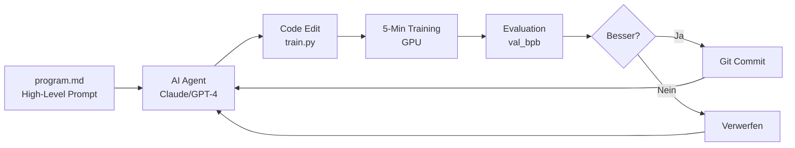

# Andrej Karpathy revolutioniert AI-Research: Autoresearch lässt Agenten über Nacht hunderte Experimente durchführen
**TL;DR:** Andrej Karpathy hat mit Autoresearch ein Open-Source-Framework veröffentlicht, das AI-Agenten befähigt, vollautomatisch Machine-Learning-Experimente durchzuführen. Das Tool modifiziert selbständig Code, trainiert Modelle und optimiert Performance-Metriken – und das alles während du schläfst.
Der ehemalige Tesla AI-Director und OpenAI-Mitgründer Andrej Karpathy hat wieder zugeschlagen: Mit seinem neuen Open-Source-Projekt "Autoresearch" automatisiert er den kompletten Machine-Learning-Forschungsprozess. Das Tool hat innerhalb weniger Tage über 31.900 GitHub-Stars gesammelt und die AI-Community elektrisiert.
## Die wichtigsten Punkte
- 📅 **Verfügbarkeit**: Seit Anfang März 2026 auf GitHub verfügbar (https://github.com/karpathy/autoresearch)
- 🎯 **Zielgruppe**: AI-Engineers, ML-Researcher, Automatisierungs-Enthusiasten
- 💡 **Kernfeature**: Vollautonome Code-Evolution ohne Human-in-the-Loop
- 🔧 **Tech-Stack**: Python, PyTorch, LLM APIs (Claude Sonnet/Opus, GPT-4/Codex), Single-GPU-Setup
- ⏱️ **Zeitersparnis**: 8+ Stunden manuelle Arbeit pro Nacht automatisiert
## Was bedeutet das für AI-Automatisierungs-Engineers?
Das spart konkret 8-12 Stunden manueller Hyperparameter-Optimierung pro Experimentserie. Im Workflow bedeutet das: Abends das High-Level-Ziel definieren, morgens die optimierten Modelle reviewen. Statt manueller Grid-Searches oder Random-Searches läuft eine intelligente, sequentielle Evolution die gezielt auf Verbesserungen optimiert.
### So funktioniert der autonome Research-Loop

Der Agent arbeitet in einer Endlosschleife nach dem Prinzip "Never stop and never ask for permission". Erfolgreiche Änderungen werden via Git committed, gescheiterte verworfen. Das System hat in der ersten Overnight-Session eine Reduktion der val_bpb (validation bits per byte) von 0.9979 auf 0.9697 erreicht – eine Verbesserung von ~2.8%. Bei 126 durchgeführten Experimenten wurden 23 erfolgreiche Commits vorgenommen.
## Technische Details der Implementation
Das Framework ist bewusst minimalistisch gehalten – nur 630 Zeilen Code für maximale Stabilität und Erweiterbarkeit:
- **Single-File-Fokus**: Der Agent modifiziert ausschließlich `train.py`
- **Fixed Components**: Dataset und Evaluations-Metriken bleiben konstant
- **Flexible Architektur**: Nicht nur Hyperparameter, sondern komplette Architektur-Changes möglich
- **GPU-Anforderung**: Optimiert für NVIDIA H100 (5-Minuten Trainingsfenster), Community-Forks existieren für kleinere GPUs wie RTX 4090
### Integration in bestehende Automatisierungs-Stacks
Die Integration mit Tools wie n8n, Make oder Zapier ermöglicht erweiterte Workflows:
1. **Trigger**: Neue Research-Hypothese via Webhook
2. **Autoresearch**: Overnight-Experimente auf Cloud-GPU
3. **Results**: Automatisches Reporting via Slack/Email
4. **Deployment**: Beste Modelle direkt in Production-Pipeline
## Praktische Anwendungsfälle im Detail
### 1. Automatisierte Modell-Optimierung
**Zeitersparnis: 8-12 Stunden pro Nacht**
- Setup einmalig 30 Minuten
- Läuft autonom über Nacht
- Morgens fertige, optimierte Modelle
### 2. A/B-Testing für AI-Architekturen
**ROI: 10x effizientere Resource-Nutzung**
- Sequentielle statt parallele Experimente
- Binary-Search statt Grid-Search
- Intelligente Hypothesen-Evolution
### 3. Software-Performance-Optimierung
**Impact: Beliebiger Code optimierbar**
- Nicht nur ML-Modelle
- Jede messbare Metrik optimierbar
- Git-History als Dokumentation
## Community-Forks und Erweiterungen
Die Open-Source-Community hat bereits mehrere interessante Forks entwickelt:
- **autoresearch-everywhere** (github.com/Entrpi/autoresearch-everywhere): Cross-Platform-Optimierung und erweiterte Experiment-Logging-Features
- **pi-autoresearch** (github.com/davebcn87/pi-autoresearch): Autonomer Experiment-Loop für Pi-basierte Systeme (~1.2K Stars)
- Community-adaptierte Versionen für kleinere GPUs wie RTX 4090 (erwähnt in YouTube-Tutorials)
## Was macht Autoresearch anders als bestehende Tools?
Im Vergleich zu klassischen Hyperparameter-Optimierungs-Tools wie Ray Tune oder Optuna:
- **Volle Code-Autonomie**: Nicht nur Parameter, sondern Architektur-Changes
- **Sequentielle Evolution**: Effizienter als parallele Grid-Searches
- **Zero Human Intervention**: Läuft tagelang ohne Unterbrechung
- **Git-basierte Historie**: Vollständige Nachvollziehbarkeit aller Änderungen
⚠️ **Wichtiger Hinweis**: Das Tool modifiziert autonom Code. Immer in isolierten Umgebungen ausführen und kritische Systeme schützen.
## Praktische Nächste Schritte
1. **Quick Start** (30 Minuten):
   ```bash
   git clone https://github.com/karpathy/autoresearch
   pip install -r requirements.txt
   # GPU mieten bei Lambda/RunPod falls keine vorhanden
   # program.md anpassen mit eigenem Research-Ziel
   python main.py
   ```
2. **Integration in bestehende Workflows**:
   - Webhook-Trigger via n8n/Zapier einrichten
   - Cloud-GPU-Automation mit Terraform/Pulumi
   - Result-Pipeline zu MLflow/Weights&Biases
3. **Community beitreten**:
   - GitHub-Discussions für Fragen und Ideen
   - Eigene Forks für spezielle Use Cases
   - Ergebnisse und Learnings teilen
## Business-Impact und ROI
Für AI-Teams bedeutet Autoresearch konkret:
- **Zeitersparnis**: 40+ Stunden pro Woche bei kontinuierlicher Nutzung
- **Kostenreduktion**: 10x effizienter GPU-Nutzung durch sequentielle Optimierung
- **Qualitätssteigerung**: Konsistente, reproduzierbare Experimente
- **Wissensaufbau**: Git-History als automatische Dokumentation
Die wahre Revolution liegt in der Demokratisierung von AI-Research: Kleine Teams können nun mit den gleichen automatisierten Methoden arbeiten wie große Tech-Konzerne.
## Zukunftsausblick
Karpathy hat parallel "AgentHub" gelaunched – eine agent-first Kollaborationsplattform (vergleichbar mit "GitHub für Agenten"). Die Vision: AI-Agent-Swarms, die gemeinsam an Codebasen arbeiten. Autoresearch dient als erste Use-Case-Demonstration für diese Multi-Agent-Kollaboration. Dies markiert den Anfang einer neuen Ära vollautomatisierter AI-Entwicklung.
## Quellen & Weiterführende Links
- 📰 [Autoresearch Analyse von Ken Huang](https://kenhuangus.substack.com/p/exploring-andrej-karpathys-autoresearch)
- 💻 [GitHub Repository](https://github.com/karpathy/autoresearch)
- 🤖 [Karpathys AgentHub-Ankündigung](https://www.youtube.com/watch?v=qb90PPbAWz4) (Agent-First Kollaborationsplattform)
- 🎥 [YouTube-Tutorial zur Installation](https://www.youtube.com/watch?v=X6M1cX-8LRQ)
- 💬 [Hacker News Discussion](https://news.ycombinator.com/item?id=47291123)
- 🎓 [AI-Automation Workshop auf workshops.de](https://workshops.de/ai-automation)