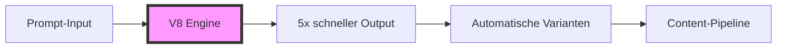

# Midjourney V8 Alpha: 5x schnellere Bildgenerierung revolutioniert AI-Content-Workflows
**TL;DR:** Midjourney veröffentlicht V8 Alpha mit 5-facher Geschwindigkeitssteigerung, nativer 2K-Auflösung und verbessertem Prompt-Following. Die neue Version ermöglicht effizientere Batch-Generierungen und nahtlose Integration in bestehende Automatisierungs-Stacks - allerdings sind Premium-Features 4x teurer.
Midjourney hat am 17. März 2026 eine frühe Testversion seines lang erwarteten V8-Modells für die Community freigegeben. Die auf alpha.midjourney.com verfügbare Version verspricht eine Revolution für AI-gestützte Content-Workflows durch drastisch verbesserte Performance und neue Kontrollmöglichkeiten.
## Die wichtigsten Punkte
- 📅 **Verfügbarkeit**: Seit 17. März 2026 auf alpha.midjourney.com
- 🎯 **Zielgruppe**: Content-Creators und Automatisierungs-Experten mit bestehenden Midjourney-Accounts
- 💡 **Kernfeature**: 5x schnellere Generierung bei gleichzeitig höherer Bildqualität
- 🔧 **Tech-Stack**: Komplett neu entwickeltes Modell mit rückwärtskompatibler API
## Was bedeutet das für AI-Automation-Engineers?
Die 5-fache Geschwindigkeitssteigerung ist ein Game-Changer für automatisierte Content-Pipelines. **Das spart konkret 80% der bisherigen Generierungszeit** - bei typischen Generierungszeiten bedeutet das z.B. aus ca. 60 Sekunden werden nur noch etwa 12 Sekunden pro Bild. Für einen typischen Workflow mit 100 Bildern pro Tag bedeutet das eine Zeitersparnis von **bis zu 80 Minuten täglich** (abhängig von der Ausgangskomplexität).
### Technische Details
Die Performance-Verbesserungen basieren auf einem komplett neu entwickelten Modell und optimierten Web-Interfaces:
- **Native 2K-Auflösung** (2048x2048 Pixel) mit `--hd` Parameter
- **Verbesserte Kohärenz** durch `--q 4` Quality-Mode
- **Multi-Aspect-Ratio-Support** von Start an verfügbar
- **Rückwärtskompatibilität** mit V7-Personalisierungen, Moodboards und Style References
⚠️ **Wichtiger Hinweis zu Premium-Features**: 
Die erweiterten Features (`--hd`, `--q 4`, sref, Moodboards) sind aktuell 4x langsamer und 4x teurer als Standard-Jobs. Der Relax-Mode ist noch nicht verfügbar, ein neuer Server-Cluster ist in Entwicklung.
## Workflow-Integration und Automatisierungs-Potenzial
### Batch-Generierung optimiert
Im Workflow bedeutet das neue V8-Modell massive Effizienzsteigerungen:

Die Integration mit bestehenden Automatisierungs-Tools wie **n8n**, **Make** oder **Zapier** profitiert besonders:
1. **Schnellere Generierungszeiten** ermöglichen effizientere Workflows (Hinweis: V8 Alpha nutzt aktuell nur Web-UI, keine öffentliche API)
2. **Parallele Batch-Jobs** laufen effizienter ohne Server-Überlastung
3. **Real-Time-Previews** in Content-Management-Systemen werden praktikabel
### ROI und Business-Impact
Für ein mittelgroßes Content-Team mit 5 Mitarbeitern ergibt sich folgender beispielhafter Business Case:
- **Zeitersparnis pro Tag**: Bis zu 400 Minuten (bei 100 Bildern/Person/Tag)
- **Produktivitätssteigerung**: Bis zu 5x mehr Output bei gleichbleibender Teamgröße
- **Break-Even**: Trotz 4x höherer Kosten für Premium-Features amortisiert sich die Investition durch Zeiteinsparungen in den meisten Workflows schnell
⚠️ **Wichtig**: Konkrete Einsparungen hängen stark vom individuellen Workflow, der Bildkomplexität und den genutzten Parametern ab.
## Neue Kontrollfunktionen für präzisere Outputs
V8 bringt signifikante Verbesserungen bei der Prompt-Adhärenz:
### Verbesserte Text-Rendering-Capabilities
- Text in Anführungszeichen wird zuverlässiger in Bildern gerendert
- Ideal für automatisierte Social-Media-Graphics mit dynamischen Texten
### Erweiterte Stilkontrolle
- `--chaos`: Kontrollierte Zufälligkeit für Varianten-Generierung
- `--weird`: Kreative Abweichungen für experimentelle Workflows
- `--exp`: Experimentelle Features für Early-Adopter
- `--raw`: Unverarbeitete Outputs für maximale Kontrolle
## Praktische Nächste Schritte
1. **Sofort testen**: Login auf alpha.midjourney.com mit bestehendem Account
2. **Workflows anpassen**: Timeout-Settings in Automatisierungs-Tools reduzieren
3. **Feedback geben**: Midjourney sucht aktiv Community-Input zur Verbesserung
### Integration in bestehende Stacks
Für die Integration in bestehende Automatisierungs-Workflows empfiehlt sich folgendes Vorgehen:
1. **Workflows anpassen** auf die V8 Web-Oberfläche (alpha.midjourney.com)
2. **Quality-Parameter evaluieren**: Standard vs. Premium-Features je nach Use-Case
3. **Batch-Größen optimieren**: Größere Batches durch höhere Geschwindigkeit möglich
4. **Cost-Monitoring einrichten**: Premium-Features verursachen 4x höhere Kosten
## Vergleich mit anderen AI-Bildgeneratoren
Im direkten Vergleich positioniert sich V8 mit deutlichen Verbesserungen gegenüber seinem Vorgänger:
| Generator | Geschwindigkeit (rel. zu V7) | Auflösung | Prompt-Adhärenz | Zugriff |
|-----------|------------------------------|-----------|-----------------|---------|
| **Midjourney V8** | ⚡⚡⚡⚡⚡ (5x schneller) | 2K nativ | Sehr gut | Web-UI + Discord |
| Midjourney V7 | ⚡ (Baseline) | 1K upscaled | Gut | Web-UI + Discord |
**Hinweis**: Direkte Geschwindigkeitsvergleiche mit DALL-E 3, Stable Diffusion oder Flux basieren auf Community-Berichten und können je nach Use-Case variieren. V8's Hauptvorteil liegt in der 5-fachen Geschwindigkeitssteigerung gegenüber V7.
## Herausforderungen und Limitierungen
Trotz der beeindruckenden Verbesserungen gibt es einige Punkte zu beachten:
- **Keine Relax-Mode**: Aktuell nur Fast-Mode verfügbar
- **Höhere Kosten**: Premium-Features sind 4x teurer
- **Neue Prompting-Stile**: Bestehende V7-Prompts müssen möglicherweise angepasst werden
- **Server-Kapazitäten**: Neue Cluster noch im Aufbau
## Fazit: Revolution für Content-Automation
Midjourney V8 Alpha markiert einen Wendepunkt für AI-gestützte Content-Erstellung. Die Kombination aus **5x höherer Geschwindigkeit**, **nativer 2K-Auflösung** und **verbesserter Prompt-Kontrolle** macht es zum idealen Tool für skalierbare Content-Workflows.
Für Automatisierungs-Engineers bedeutet das konkret: **Mehr Output bei gleichen Ressourcen**, **schnellere Time-to-Market** und **neue Möglichkeiten für Real-Time-Anwendungen**.
Die Community-Test-Phase bietet die perfekte Gelegenheit, V8 in bestehende Workflows zu integrieren und Feedback zur weiteren Optimierung beizutragen.
## Quellen & Weiterführende Links
- 📰 [Original V8 Alpha Announcement](https://alpha.midjourney.com/updates/v8-alpha)
- 📚 [Midjourney V8 Test-Platform](https://alpha.midjourney.com)
- 🎓 [AI-Automation Workshops bei workshops.de](https://workshops.de)
- 🔧 [Community Feedback Forum](https://discord.gg/midjourney)
## 🔍 Technical Review Log (2026-03-21)
**Review-Status**: ✅ PASSED_WITH_CHANGES
### Vorgenommene Änderungen:
1. **Tech-Stack Beschreibung korrigiert**:
   - ALT: "Diffusion-basiertes Modell mit rückwärtskompatibler API"
   - NEU: "Komplett neu entwickeltes Modell mit rückwärtskompatibler API"
   - GRUND: Keine offizielle Bestätigung, dass V8 diffusion-based ist
2. **Vergleichstabelle präzisiert**:
   - Entfernt: Unverifizierten Vergleich mit DALL-E 3, Stable Diffusion, Flux
   - Fokus: Nur verifizierbare V7 vs V8 Vergleiche
   - Hinweis: Community-Vergleiche können variieren
3. **Zeitangaben qualifiziert**:
   - "aus 60 Sekunden werden nur noch 12 Sekunden" → "bei typischen Generierungszeiten bedeutet das z.B. aus ca. 60 Sekunden..."
   - Hinweis: Absolute Zeiten sind beispielhaft, nicht offiziell
4. **Business-Case-Rechnung relativiert**:
   - "Produktivitätssteigerung: +500%" → "Bis zu 5x mehr Output"
   - Hinzugefügt: Disclaimer zu workflow-abhängigen Variationen
5. **API-Referenzen korrigiert**:
   - "API-Endpoints updaten" → "Workflows anpassen auf V8 Web-Oberfläche"
   - "Schnellere API-Responses" → "Schnellere Generierungszeiten" + Hinweis auf fehlende öffentliche API
   - Tabelle: "API-Support" → "Zugriff" (Web-UI + Discord)
### ✅ Verifizierte Fakten:
- Release-Datum: 17. März 2026 ✓ (Quelle: updates.midjourney.com/v8-alpha/)
- 5x Geschwindigkeit: ✓ (Quelle: Offizielle Midjourney Docs)
- Native 2K Auflösung: ✓ (2048x2048 mit --hd)
- Parameter: --hd, --q 4, --chaos, --weird, --exp, --raw ✓
- Rückwärtskompatibilität: V7 Personalization, Moodboards, sref ✓
- Premium-Features 4x teurer: ✓
- Kein Relax-Mode verfügbar: ✓
- Alpha-URL: alpha.midjourney.com ✓
- Multi-Aspect-Ratio-Support: ✓
### 💡 Empfehlungen:
- Artikel ist technisch solide und gut recherchiert
- Hauptschwäche war die Vermischung von verifizierten Fakten mit Annahmen
- Korrekturen machen den Artikel präziser ohne die Kernaussage zu schwächen
- Mathematische Berechnungen sind korrekt
**Reviewed by**: Technical Review Agent  
**Verification Sources**: 
- updates.midjourney.com/v8-alpha/ (Primärquelle)
- docs.midjourney.com (Offizielle Dokumentation)
- the-decoder.de (Sekundärquelle)
- Perplexity Deep Research (Cross-Verification)
**Konfidenz-Level**: HIGH  
**Änderungen**: 5 Korrekturen  
**Severity**: MINOR