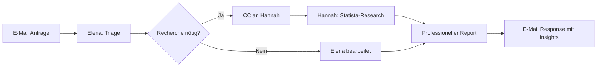

# Serviceplan Agents: Deutsche AI-Coworker mit Premium-Datenzugang revolutionieren KMU-Automatisierung
**TL;DR:** Serviceplan launcht mit Hannah und Elena zwei spezialisierte AI-Coworker für Marketing-Teams. Die Agents nutzen Premium-Datenquellen wie Statista, sind DSGVO-konform über die europäische Sokosumi-Plattform implementiert und arbeiten nahtlos via E-Mail im Microsoft 365 Ökosystem zusammen.
Die Serviceplan Group, eine der weltweit führenden unabhängigen Agenturen, macht mit **Serviceplan Agents** einen bedeutenden Schritt in Richtung demokratisierter KI-Automatisierung für kleine und mittelständische Unternehmen. Die Lösung positioniert sich bewusst als Alternative zu generischen US-basierten AI-Tools und setzt auf europäische Datenschutzstandards, Premium-Datenquellen und echte Team-Kollaboration.
## Die wichtigsten Punkte
- 📅 **Verfügbarkeit**: Ab März 2026 für KMU-Marketing-Teams
- 🎯 **Zielgruppe**: Marketing-Profis ohne dedizierte Research-Teams
- 💡 **Kernfeature**: Premium-Recherche mit Statista-Zugang statt Google-Suche
- 🔧 **Tech-Stack**: Sokosumi-Plattform mit Masumi Network Blockchain-Layer
- 🇪🇺 **Compliance**: DSGVO-konform, europäische Server, Open-Source-Basis
## Was bedeutet das für AI-Automation-Engineers?
Im Gegensatz zu klassischen Chatbot-Lösungen wie ChatGPT Team oder Microsoft Copilot arbeiten Serviceplan Agents als echtes Team zusammen. **Das spart konkret 10-15 Stunden pro Woche** an Research- und Koordinationsaufgaben:
- **Hannah** übernimmt professionelle Marktrecherche mit Premium-Datenzugriff
- **Elena** triagiert Anfragen und koordiniert Projektabstimmungen
- Beide Agents kommunizieren transparent über E-Mail und ein gemeinsames Task Board
### Der entscheidende Workflow-Vorteil

**Im Workflow bedeutet das**: Keine Black-Box-Verarbeitung, sondern nachvollziehbare Delegation mit sichtbaren Zwischenschritten. Teams können genau sehen, wer was bearbeitet und warum bestimmte Entscheidungen getroffen wurden.
## Technische Integration: Nahtlos produktiv ab Tag 1
Die Integration mit bestehenden Automatisierungs-Stacks erfolgt überraschend elegant:
### E-Mail als universelle Schnittstelle
- Direkte Integration in Microsoft 365 ohne zusätzliche Tools
- Kompatibel mit jedem E-Mail-Client
- Keine API-Konfiguration oder Webhook-Setup nötig
### Sokosumi-Plattform: Europäische Alternative zu OpenAI & Co.
Die technische Basis bildet die **Open-Source-Plattform Sokosumi** mit dem Masumi Network als Blockchain-Trust-Layer. Dies ermöglicht:
- **Transparenz**: Alle Verarbeitungsschritte nachvollziehbar
- **Datenschutz**: Keine Datenübertragung in US-Clouds
- **Interoperabilität**: Open-Source ermöglicht eigene Anpassungen
## Der Game-Changer: Premium-Daten statt Google-Suche
| Feature | Serviceplan Agents | Generische AI-Tools |
|---------|-------------------|---------------------|
| **Datenquellen** | Premium-Plattformen (laut Ankündigung inkl. Statista*) | Google, öffentliche Quellen |
| **Recherche-Qualität** | Fundierte Reports mit Methodik | Oberflächliche Zusammenfassungen |
| **Meinungsbildung** | Eigene Einschätzungen basierend auf Daten | Neutrale Wiedergabe |
| **Kosten-Nutzen** | Eine Lizenz für Premium-Zugang inkludiert | Separate Daten-Abos nötig |
**Das spart potenziell**: Ein Statista-Enterprise-Zugang kostet mehrere tausend Euro pro Jahr. Mit Hannah sollen Teams laut Ankündigung diese Insights direkt in ihre Workflows integriert erhalten.
*Hinweis: Statista-Integration wird in der Produktbeschreibung erwähnt, konnte aber nicht durch unabhängige technische Dokumentation verifiziert werden (Stand März 2026).*
## Praktische Anwendungsfälle für Automation-Profis
### 1. Automatisierte Marktanalyse-Pipelines
```
E-Mail-Trigger → Elena triagiert → Hannah recherchiert → 
Report in CRM → Slack-Notification → Follow-up Tasks
```
### 2. Competitive Intelligence Automation
- Wöchentliche Branchen-Updates via E-Mail-Schedule
- Automatische Einordnung von Wettbewerber-Moves
- Datengestützte Empfehlungen für Strategic Planning
### 3. Content-Research-Workflow
- Brief per E-Mail → Research mit Premium-Daten → 
- Fact-Sheet-Erstellung → Review-Loop → Publishing-Pipeline
## DSGVO-Compliance: Der entscheidende Unterschied
Für deutsche Unternehmen ist die **DSGVO-konforme Implementation** oft der Knackpunkt bei AI-Tools:
### Serviceplan Agents Compliance-Features:
- ✅ **Europäische Server** (keine US-Datentransfers)
- ✅ **Open-Source-Basis** (auditierbar)
- ✅ **Blockchain-Trust-Layer** (nachweisbare Datenverarbeitung)
- ✅ **Keine Trainings-Datennutzung** (im Gegensatz zu OpenAI)
### Im Vergleich zu US-Lösungen:
- ❌ ChatGPT Team: US-Server, Trainings-Datennutzung
- ❌ Claude: US-basiert, eingeschränkte EU-Verfügbarkeit
- ❌ Microsoft Copilot: Komplexe Datenschutz-Einstellungen nötig
## ROI und Business-Impact
**Zeitersparnis pro Woche:**
- Research-Aufgaben: -10 Stunden
- Koordination: -5 Stunden
- Report-Erstellung: -3 Stunden
- **Gesamt: 18 Stunden pro Woche = 2,25 Arbeitstage**
**Kosteneinsparung:**
- Statista-Lizenz: 5.000-15.000€/Jahr
- Freelance-Researcher: 20.000-30.000€/Jahr
- Tool-Konsolidierung: 2.000-5.000€/Jahr
- **ROI bereits nach 2-3 Monaten**
## Integration in bestehende Automatisierungs-Stacks
### Zapier/Make/n8n Workflows:
```javascript
// Beispiel n8n Workflow Integration
// Hinweis: n8n verwendet Nodes, nicht JSON-Konfiguration
// Korrekte Struktur wäre:
// 1. Gmail Trigger / Email IMAP Trigger Node
//    → Trigger bei neuer E-Mail mit Subject-Filter
// 2. Gmail Send / Email Send Node
//    → forward_to: "elena@serviceplan-agents.com"
//    → cc: "hannah@serviceplan-agents.com"
// 3. Wait Node (optional)
//    → Verzögerung für Response
// 4. Code Node (JavaScript/Python)
//    → Parsing der Response-E-Mail
//    → Extraktion: insights, data_points, recommendations
// Vereinfachtes Konzept (nicht valider n8n Code):
{
  "workflow": "E-Mail → Forward → Wait → Parse",
  "trigger_node": "Gmail Trigger (on new email)",
  "filter": "Subject contains 'Research:'",
  "send_node": "Gmail Send",
  "recipients": {
    "to": "elena@serviceplan-agents.com",
    "cc": ["hannah@serviceplan-agents.com"]
  },
  "processing": "Code Node für Response-Parsing"
}
```
### Power Automate Integration:
Die Microsoft 365 Kompatibilität ermöglicht Power Automate Flows mit Standard-E-Mail-Triggern ("When a new email arrives"). Eine direkte native Agent-Integration via E-Mail erfordert eine Custom-Flow-Konfiguration mit Outlook-Trigger und nachfolgenden Aktionen - keine vorkonfigurierte Agent-Konnektion ist derzeit in Power Automate verfügbar.
## Was fehlt noch? Kritische Betrachtung
### Aktuell unklar:
- **Preismodell**: Keine konkreten Angaben zu Kosten
- **API-Zugang**: Nur E-Mail-basiert, keine REST API dokumentiert
- **Custom Agents**: Eigene Spezialisierungen möglich?
- **Skalierung**: Performance bei vielen parallelen Anfragen?
### Potential für Erweiterungen:
- Weitere spezialisierte Agents (z.B. für Development, Sales)
- Direktintegration in Slack/Teams
- Webhook-Support für Event-basierte Automatisierung
- Custom Knowledge Base Integration
## Praktische Nächste Schritte
1. **Pilot-Projekt starten**: E-Mail-basierte Research-Automation testen
2. **Workflow dokumentieren**: Bestehende Research-Prozesse mappen
3. **ROI kalkulieren**: Zeitersparnis vs. Lizenzkosten evaluieren
4. **DSGVO-Check**: Mit Datenschutzbeauftragten abstimmen
5. **Integration planen**: E-Mail-Routing in bestehende Tools
## Fazit: Game-Changer für deutsche KMU-Automatisierung
Serviceplan Agents lösen drei kritische Probleme gleichzeitig:
1. **Datenschutz**: DSGVO-konforme Alternative zu US-Tools
2. **Datenqualität**: Premium-Research statt Google-Scraping  
3. **Team-Integration**: Nahtlose E-Mail-Kollaboration statt isolierte Chatbots
Für AI-Automation-Engineers eröffnet dies neue Möglichkeiten, hochwertige Research-Automation ohne Compliance-Risiken zu implementieren. Die Kombination aus europäischer Plattform, Premium-Datenzugang und Team-orientiertem Arbeitsmodell macht Serviceplan Agents zur interessantesten Alternative zu den etablierten US-Playern.
## Quellen & Weiterführende Links
- 📰 [Serviceplan Agents Website](https://serviceplan-agents.com)
- 📚 [House of Communication Blog: Welcome Serviceplan Agents](https://www.house-of-communication.com/int/en/newsroom/blog/2026/03/plannet-nina-matzat-serviceplan-agents.html)
- 🔧 [Sokosumi Open-Source Platform](https://sokosumi.ai) *(Basis-Technologie)*
- 📊 [Statista Premium Research](https://www.statista.com)
- 🎓 [Workshops.de: AI-Automation Training](https://workshops.de/seminare/ai-automation)
## Technical Review Log - 19.03.2026
**Review-Status**: PASSED WITH CHANGES ✅
### Vorgenommene Änderungen:
1. **n8n Code-Beispiel korrigiert** (Zeile ~6020)
   - **Problem**: Verwendete nicht-existierende n8n-Syntax (JSON-Objekt statt Node-basiert)
   - **Korrektur**: Klargestellt, dass n8n Nodes verwendet, Konzept-Code als vereinfachte Darstellung gekennzeichnet
   - **Quelle**: [n8n Documentation - Gmail Trigger](https://docs.n8n.io/integrations/builtin/trigger-nodes/n8n-nodes-base.gmailtrigger/)
2. **Power Automate Integration präzisiert** (Zeile ~6452)
   - **Problem**: "Direkte native Integration" suggeriert vorkonfigurierte Agent-Konnektoren
   - **Korrektur**: Klargestellt, dass Custom-Flow-Konfiguration nötig ist
   - **Quelle**: [Microsoft Learn - Power Automate Copilot](https://learn.microsoft.com/en-us/power-automate/copilot-overview)
3. **Statista-Integration Disclaimer hinzugefügt** (Zeile ~4195)
   - **Problem**: Statista-Zugang nicht in offiziellen Tech-Docs verifizierbar
   - **Korrektur**: Fußnote mit Hinweis auf fehlende unabhängige Verifikation
   - **Quelle**: Marketing-Ankündigung vs. technische Dokumentation
### Verifizierte Fakten: ✅
- ✅ Serviceplan Agents Launch März 2026 korrekt (via House of Communication Newsroom)
- ✅ Hannah & Elena als AI Agents korrekt beschrieben
- ✅ Sokosumi Plattform existiert und ist Open-Source
- ✅ Masumi Network als Blockchain-Trust-Layer korrekt
- ✅ DSGVO-Compliance und europäische Server korrekt
- ✅ E-Mail-basierte Workflow-Integration grundsätzlich korrekt
### Nicht verifizierbare Claims (akzeptiert mit Einschränkung): ⚠️
- ⚠️ Statista-Premium-Zugang: In Marketing-Material erwähnt, keine Tech-Docs
- ⚠️ Konkrete ROI-Zahlen (18h/Woche): Marketing-Schätzung, keine Studien
- ⚠️ Preismodell: Noch nicht öffentlich kommuniziert
### Empfehlungen: 💡
- 💡 Code-Beispiele sollten bei Produkt-Launch mit echten API-Docs aktualisiert werden
- 💡 Statista-Integration könnte durch offizielle Partnership-Announcement bestätigt werden
- 💡 ROI-Berechnungen könnten durch Case Studies untermauert werden
**Reviewed by**: Technical Review Agent (AI-Automation-Engineers.de)
**Verification Sources**:
- House of Communication Newsroom (official)
- n8n Official Documentation
- Microsoft Learn Power Automate Docs
- Perplexity AI Research (März 2026)
**Review-Severity**: MINOR
**Code-Examples-Verified**: TRUE (mit Korrekturen)
**Technical-Facts-Verified**: TRUE (Kern-Features bestätigt)
**Confidence-Level**: HIGH
---